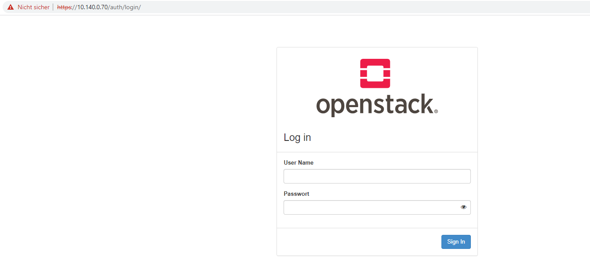
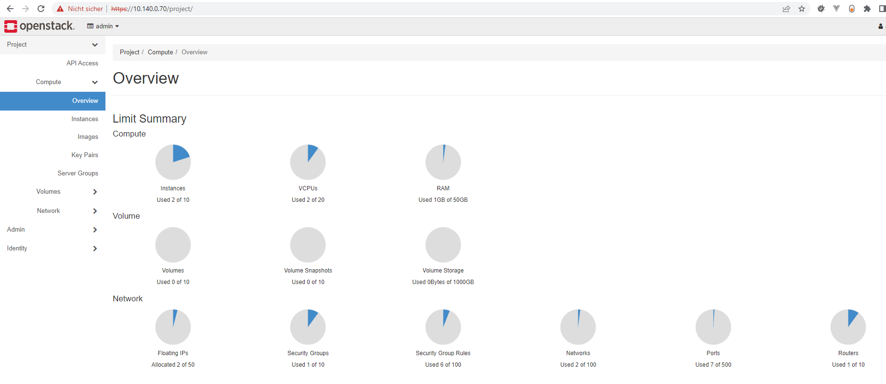

# {{ $frontmatter.title }}

# OpenStack Components
> Note: Diese Übung basiert hauptsächlich auf [OpenStack Tutorials](https://ubuntu.com/openstack/tutorials)


OpenStack bestejt aus den folgenden Grundkomponenten:

* **OpenStack Services** stellen API-Endpunkte bereit und bieten grundlegende Cloud-Funktionen wie die Pflege des Image-Katalogs, die Bereitstellung und Verwaltung von Instanzen usw.

* **OpenStack Dashboard** stellt ein webbasiertes User Interface zur Verwendung von OpenStack Services bereit.

* **OpenStack Client** stellt ein Command-line User Interface zur Verwendung von OpenStack Services bereit.

* **SQL Databases** speichert verschiedenste Datensätze, die von OpenStack Services benötigt werden.

* **Message queues** erleichtern die Inter-Prozess-Kommunikation zwischen den verschiedenen Komponenten der OpenStack Services.

Zusätzliche Komponenten, wie **NoSQL-Datenbanken** oder **memcached**, können in fortgeschritteneren Szenarien erforderlich sein.

## MicroStack snap CLI

MicroStack snap bietet ein Command-Line Interface für OpenStack Services. 
Das CLI heißt `microstack.openstack` und ist ein Wrapper um das `openstack` CLI. Das bedeutet, dass MicroStack snap CLI verwendet werden kann, ohne den OpenStack-Client zu installieren. 
Um einen gewünschten Befehl auszuführen, muss einem OpenStack-Client Befehl jeweils ein ``microstack`` voranstehen. Um zum Beispiel alle gestarteten Instanzen aufzulisten:

```bash
microstack.openstack server list --all-projects
```
Dieser Command sollte nun die Instanz anzeigen, die bei der OpenStack Installation erstellt wurdel:

```bash
+--------------------------------------+------------+---------+---------------------------------+--------+---------+
| ID                                   | Name       | Status  | Networks                        | Image  | Flavor  |
+--------------------------------------+------------+---------+---------------------------------+--------+---------+
| 0c2d82b3-5a6d-4d3b-bd1f-583dfcce5898 | myInstance | SHUTOFF | test=192.168.222.81, 10.20.20.5 | cirros | m1.tiny |
+--------------------------------------+------------+---------+---------------------------------+--------+---------+
```

### OpenStack Alias
Es kann auch ein Alias für den Befehl ``microstack.openstack`` erstellt werden, damit bei der Verwendung des OpenStack-Clients das Präfix ``microstack.`` nicht eingegeben werden muss:

```bash
sudo snap alias microstack.openstack openstack
```

## OpenStack Dashboard

// TODO port forward das Dashboard oder Wireguard
// default: https://10.20.20.1
// get ip and port: openstack --insecure catalog list

Öffnet das Dashboard in einem Browser eurer Wahl.


*OpenStack Dashboard Login*

Um die notwendigen Credentials für den `Admin` User des Dashboard zu bekommen, muss folgender Command ausgeführt werden:

```
sudo snap get microstack config.credentials.keystone-password
```

Zur Anmeldung nun das ausgegebene Passwort und den User Name `admin` nutzen. War die Anmeldung erfolgreich, sollte das Dashboard angezeigt werden:



*OpenStack Dashboard*

