# Create and Manage IaaS Resources in OpenStack

::: warning Hint
Following commands must run on your virtual machine (eg. your Proxmox machine) via SSH or in Proxmox Console. Prefer SSH since you can use copy+paste.
:::

Before we start to create resources in our Openstack environment, please check if all services are running with ``systemctl status devstack@*``.

## Login to Dashboard
Login to your Horizon Dashboard using ``admin`` as username and your password from `local.conf` file.

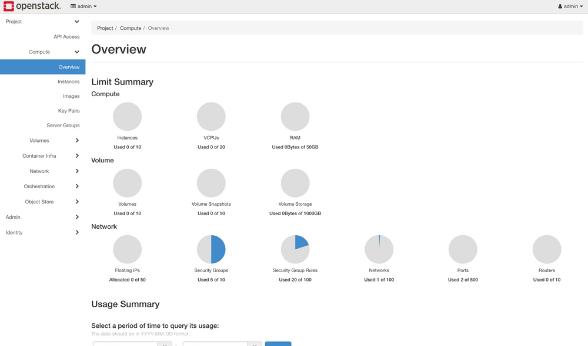
*OpenStack Dashboard.* 

Your OpenStack environment is divided through the use of projects (see tabs on the left). Every project can have associated users, which have different levels of permissions defined by user roles.
In this exercise we will create a new Project and User in our OpenStack environment. Afterwards we will create a Private Network and launch a Virtual Machine inside that network. 
Furthermore, we will configure our Private Network to talk to the public network so that we can access the OpenStack Virtual Machine through our Proxmox Machine.

But first, let's have a look into the OpenStack Dashboard. 
After logging into your Dashboard as an administrator you well see the tabs ``Projects``, `Admin` and `Identity` in the left-hand corner. 
Items under the ``Projects`` tab allow you to view and manage resources in a selected project, like instances and images. You can toggle between projects by using the dropdown menu in the upper left-hand corner, which should show `admin` and `demo` projects after a clean installation of DevStack.

Within the ``Projects`` tab, you have the ability to view and configure additional settings tabs that will help you manage your instances. 
These additional tabs include the ``Compute``, ``Volumes`` and `Network`. In a real-world installation of OpenStack there can be more than those 3 tabs, e.g.: ``Container Infra``, ``Orchestration`` and ``Object Store``.

The **Compute** tab contains the following views and options:

* **Overview** allows you to view reports for the project.
* **Instances** allow you to view and launch an instance. You can also create an instance from a snapshot and stop, pause, or reboot instances.
* **Images** allow you to view images and instance snapshots, as well as images that are publicly available. You can launch instances from images and snapshots, and create edit, and delete images.
* **Key Pairs** allow you to view, create, edit, import, and delete key pairs. For example needed to allow ``SSH`` connections to your instances
* **Server Groups** allow a server group to be assigned to launch the instance.

The **Volumes** tab contains the following views and options:

* **Volumes** allows you to view, create, edit, and delete volumes. A volume refers to a block storage device that can be attached to an instance. It provides persistent storage to instances, allowing to store and retreive data independently from your instance state (eg running, shut down)
* **Backups** allow you to view, create, edit, and delete backups.
* **Snapshots** allow you to view, create, edit, and delete volume snapshots.
* **Groups** allow you to view, create, edit, and delete consistency groups.
* **Group** Snapshots allow you to view, create, edit, and delete consistency group snapshots.

The **Network** tab contains the following views and options:

* **Network Topology** allows you to view the network topology.
* **Networks** allows you to create and manage public and private networks.
* **Routers** allow you to create and manage routers, which are connected to your networks.
* **Security Groups** allow you to view, create, edit, and delete security groups and security group rules.
* **Floating IPs** allows you to assign an IP address to or release it from a project.


Items under the ``Identity`` tab give you the ability to view and manage projects that you’re on, as well as assign and remove users.

The **Identity** tab contains the following views and options:

* **Projects** allow you to view, create, assign users to, remove users from, and delete projects.
* **Users** allow you to view, create, enable, disable and delete users.
* **Application Credentials** allow you to create and manage credentials for accessing a selected project.

    
## Create a Project
First we will create a new Project and associate a User with it. To create your first project, navigate to Identity -> Projects.


*Projects.*

Several projects already exist, including the admin project. These projects are deployed by default and generally should not be modified.

Click the ``Create Project`` button near the top right to create a new project.

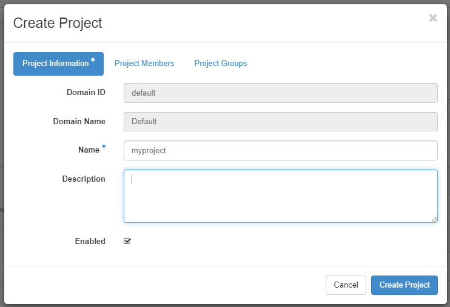
*Create a Project*

Under the Name field, specify a name for the project. 
This example project is called **myproject**. You can also add Project Members and Project Groups but we are not going to cover those yet. Click Create Project to finish creating the first project.

Once created, the project appears in the Project Listing page.
 
## Create a User
Now that we have a project, we can associate a user to it. 
There is already the default ``admin`` user. To create a new user first navigate as admin to Identity -> Users. 
By default, there are several users already listed for specific OpenStack services. These are created during cloud deployment and should generally not be modified.

Click the ``Create User`` button.

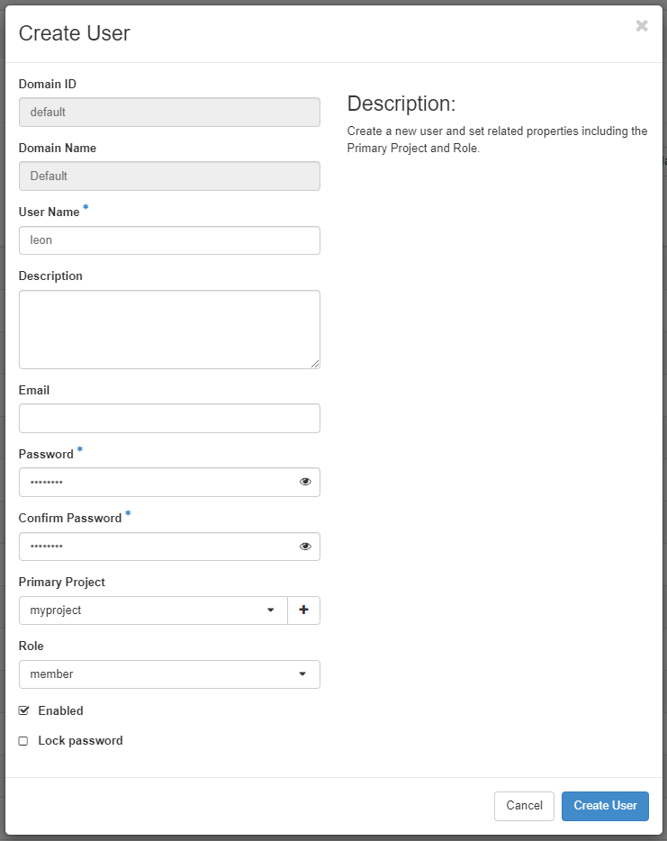
*Create a User*

On the Create User form set values for **Username, Password, Primary Project, and Role**. 
Choose a password that you can remember easily. For the `Primary Project` choose the project you created earlier.
For ``Role`` there are several options depending on the level of access required. 
The default OpenStack roles are reader, member, and admin. Additional roles also exist in the drop down. 
Reader is the least authoritative role in the hierarchy. For this example, choose ``member`` for the role.

Press Create User to create the user.

Afterwards navigate back to **Projects** and select ``Manage members`` on the right corner of your project.
Make sure that your new user and the ``admin`` user are associated with your project and have the correct permissions:

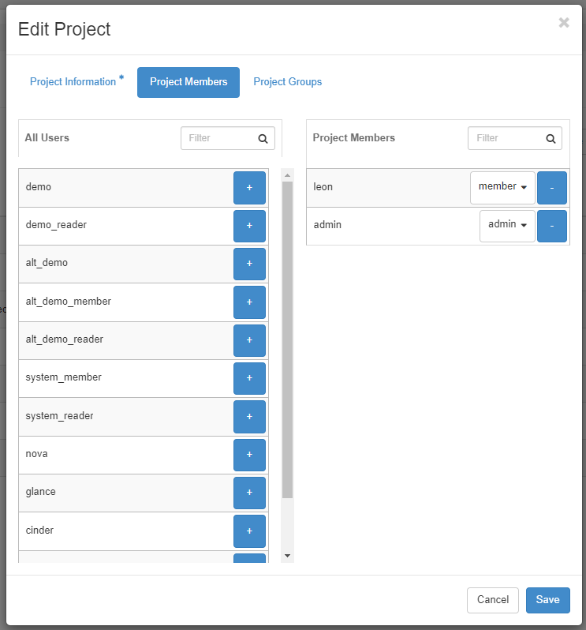
*Manage User Permissions in Project*

Next, log out of Horizon as admin, and log back in with your new user. Upon logging back in you are by default in the newly created project. You can see the project you are currently in at the top left and your user can be seen at the top right of Horizon.


*User Dashboard*

## Manage Images and Virtual Machines in OpenStack
Before we will create the Private Network and Virtual Machine, let's take a look into the ``Images`` tab under `Compute`.
Images contain a bootable operating system that OpenStack uses to create an Instance. 

The DevStack installation comes with a preinstalled image ``cirros-0.6.1-x86_64-disk`` which we will use in this exercise.

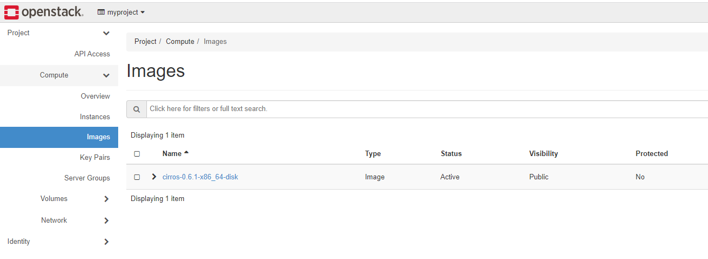
*OpenStack Images*

It is possible to upload other image files to use different operating systems in your virtual machine instances.
For example you could Download [CentOS ISO](http://ftp.tugraz.at/mirror/centos/8-stream/isos/x86_64/) and add it to your images via the ``Create Image`` section.
In this exercise we will use the preinstalled CirrOS image.

### Instances in OpenStack
With OpenStack, instances, or virtual machines, play a large role in a cloud’s workload. 
OpenStack provides a way to create and manage instances with its compute service, called **Nova**.

Nova is the OpenStack project that provides a way to provision compute instances and supports creating virtual machines, baremetal servers, and has limited support for system containers. 
Nova runs as a set of daemons on top of existing Linux servers to provide that service.

In the following steps we will create an instance, including setting up a private network and router, creating a security group, and add an SSH key pair so that we can communicate to that instance.

## Create a Private Network
Before we create a virtual machine we will setup a private network and a router in which the VM will run. 
To create a private network, begin by navigating to **Project -> Network -> Networks**. Then click ``Create Network``.


*Create Private Network*

We will create a network named ``private`` which has a subnet called `private-subnet`, which we will use to logically division our IP network.

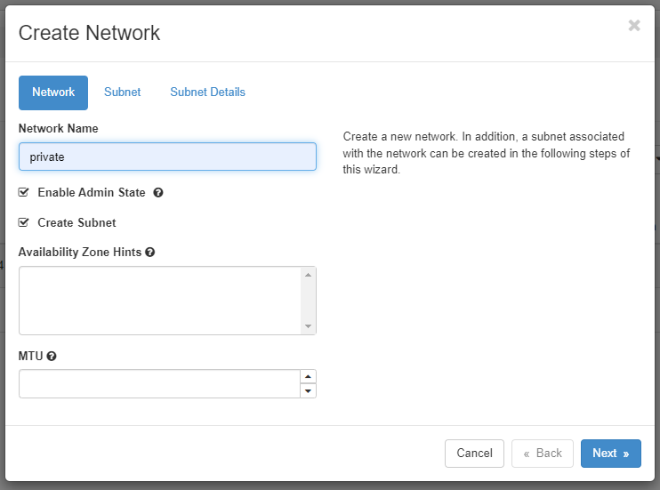
*Create Private Network Step 1*

In a first step give your Network the name ``private`` and leave all other settings by default. Press `next` to enter the Subnet menu.

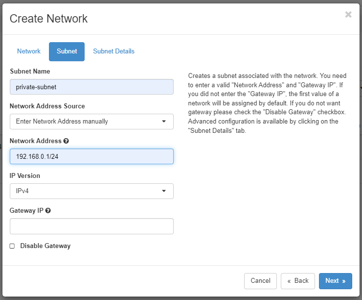
*Create Private Network Step 2*

In the Subnet tab select ``private-subnet`` as a name and give it a network range for example `192.168.0.1/24`. This allows a host range from 192.168.0.1 to 192.168.0.254, allowing for a maximum of 254 hosts within the subnet (excluding the network and broadcast addresses).

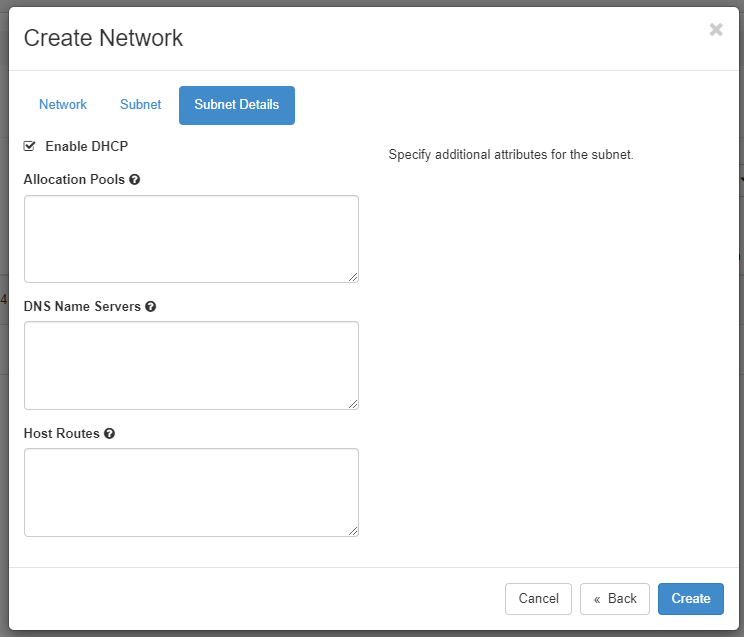
*Create Private Network Step 3*

Leave all Subnet Details by default. We let DHCP enabled so that the network automatically assigns IP addresses, subnet masks, default gateways and other network configurations.

## Create a Router
Next we will create a router to bridge the connection between the private and the public network. By default the public network is already configured in DevStack and is called ``public``.

To create a router, begin by navigating to **Project -> Network -> Routers**. Click ``Create Router``.


*Create Router*

Simply name your router ``router`` and select `public` as your external network.

Now we need to add the router to our network. We will do so by attaching an interface to it. Click ``router`` inside your Router list to navigate to the routers details screen.

Inside the router details select ``Interfaces`` and `Add Interface`:

*Add Interface to router*

On the new interface, choose the ``private-subnet`` for Subnet. 
If you don't set an IP address one is selected automatically. 
Press ``Submit`` to attach the private network to this router. The interface is then attached and now listed.


*Router Interfaces*

You can visually see the network topology for your cloud by navigating to **Project -> Network -> Network Topology**:

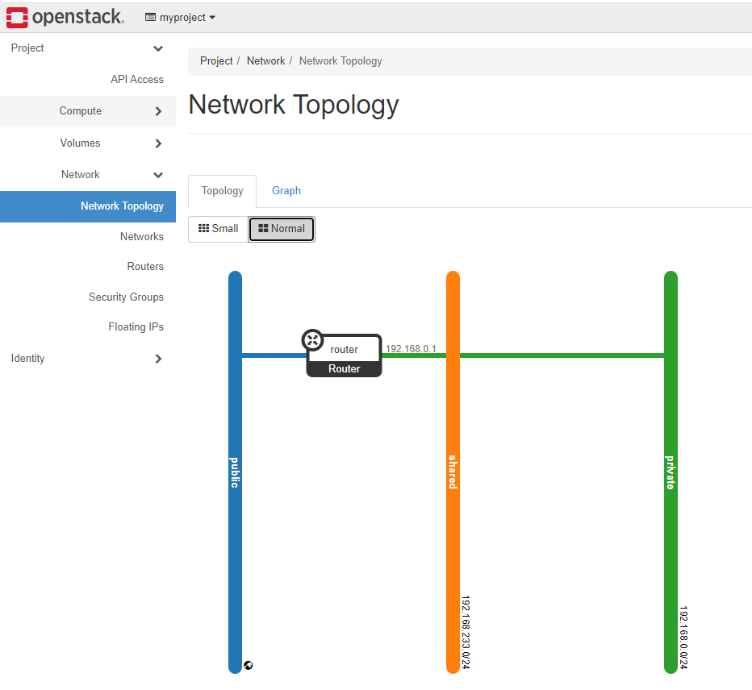
*Network Topology*

Your ``public`` network is now connected to your `private` network using the router named `router`. We can ignore the `shared` network by now, since it has no effect on our topoplogy.

## Create a Security Group
Security groups allow control of network traffic to and from virtual machines. 
For example, port 22 can be opened for SSH for a single IP or a range of IPs.

Later on we will need to SSH our instance, so we will now create a Security Group with the corresponding configurations to do so.

To view and manage security groups, navigate to **Project -> Network -> Security Groups**.

You should notice a single security group called ``default``. This security group restricts all incoming (``ingress``) network traffic and allows all outgoing (``egress``) network traffic. 
When an instance is created, this security group is applied by default.

To create a security group for SSH, click ``Create Security Group`` near the top right.
Name the group **SSH** and then click ``Create Security Group``.
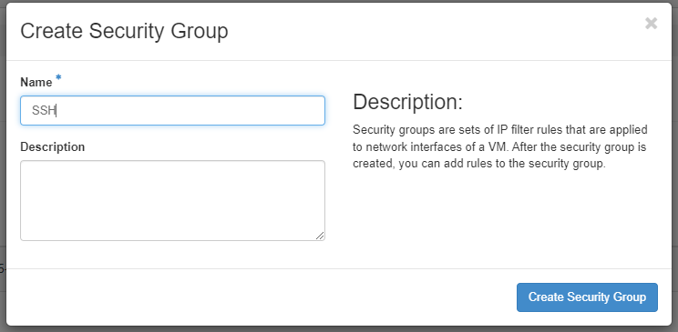
*Create Security Group*

After creating the SSH security group, we need to add a **rule** allowing SSH traffic. 
We will first apply a rule to allow pinging our future instance. 
Afterwards we will allow SSH traffic to the instance with another rule.

To add a rule, load the form by navigating to ``Add Rule`` near the top right.

Firstly, select ``All ICMP`` and click `Add` to create the rule:

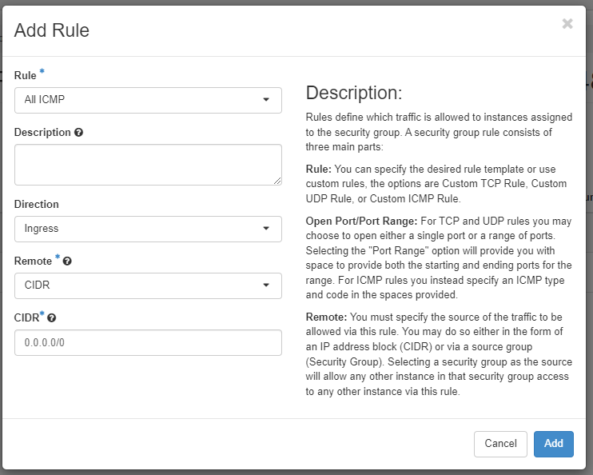
*Add rule 1*

"ALL ICMP" refers to allowing all types of ICMP (Internet Control Message Protocol) traffic.  It includes messages such as ping requests (ICMP Echo Request) and ping replies (ICMP Echo Reply), as well as other types of messages for network diagnostics, error reporting, and troubleshooting.

::: warning Warn
It's important to consider the security implications of allowing all ICMP traffic, as certain types of ICMP messages can be misused for network attacks or reconnaissance.
:::

Secondly, create another rule and select ``SSH``. Under `CIDR` you could specify a specific IP address that should be allowed to access via SSH. 
We will leave ``0.0.0.0/0`` to allow SSH from all IP addresses connected to the network.

::: danger Attention
Never allow SSH access from all IP addresses in a public cloud deployment!
::: 

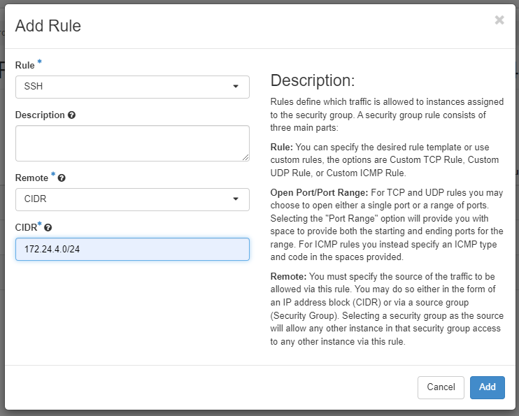
*Add rule 2*

## Create an SSH Key
To finish our first network topology with a virtual machine, we will create an instance and enable a SSH connection to it. 
To allow SSH connections we need to provide a **SSH public key** to our instance. We will create the key on our **Host VM** (eg. your VM running in Proxmox) and inject it into our instance when created.
SSH keys cannot be added to already running instances. 

So in a first step we create the SSH key on our Host VM (via SSH) and run the following command:

````shell
$ ssh-keygen
````

> Note: if asked for file location and passphrase just skip it by pressing ``Enter``

The result should look something like the following: 
````shell
Generating public/private rsa key pair.
Enter file in which to save the key (/home/<your_name>/.ssh/id_rsa): 
Enter passphrase (empty for no passphrase): 
Enter same passphrase again: 
Your identification has been saved in /home/<your_name>/.ssh/id_rsa.
Your public key has been saved in /home/<your_name>/.ssh/id_rsa.pub.
The key fingerprint is:
SHA256:BNIzHPcqCyjjZqWm88s0zqHrj8J8+gUnkF1cNOEDKZs <your_name>@<your_user>
The key's randomart image is:
+---[RSA 3072]----+
|    o=**o        |
|  o..+Bo..       |
| o .+  =. .      |
|  .E   ...       |
|o .+... S        |
|.oo +. o         |
|o*+  ..          |
|BO.+.            |
|*B@+             |
+----[SHA256]-----+
````

The private key is saved in the default location of ``/home/<your_name>/.ssh/id_rsa`` (see console output for yours) and a passphrase is set for additional security.

To view the contents of the public key, use ``cat /home/<your_name>/.ssh/id_rsa.pub``.
E.g.:
````shell
$ cat /home/leon/.ssh/id_rsa2.pub
ssh-rsa AAAAB3NzaC1yc2EAAAADAQABAAABgQCf+Jxk/vkBVaka5sRQsmtuVQcfVYAS3n2GX3Uc3YdYxzO1G6f8VYr9smte34Gkt3VQ4NJ8Vv1ePbiM+GyYwAgNIYOOBJogViQ44MRrXGuruu5azB+aSVWSdC7kh79wESJwlGpOF4MngxZEvK9p95c8OpDpH6FrptHf/TSWL1p68VzQN8am9F0a4yAeVJwI1w0cJ6rfkP+p9EppKkwX+CCl0Sv9IMt8dT9ncgnjsa9XCF404ZiMsPpEHPhydwtQpPyFUZtJ789bGyAZ6ANLub1LG/o6jLYGEmoo23KEDEf4dWZL4pEuKi89KOyx0XCk7Kbn9KF/w4dhyscgwWrK7vZTrk8VO1EevMTpqfVkpXo+SXXYvZ+adUPVYOaeT0RQQSUMeWh3rFhMmCX231Vaz9ohl5RS6xKZOucT4+5633tAH/WeNlLaRQuIJoabqH3JVq/X1pz2YeANB3zqFiqG+Kxsg8UVP0Y/Ur5y5+WjSsul4mh3FsXFjcywh89uIHp9vy0= leon@cwa-devstack
````

Copy **YOUR** entire key and save it somewhere, we will need it when creating the instance. 
It starts with "ssh-rsa" and continues all the way until the end.

## Create an Instance

To create an instance, begin by navigating to **Project -> Compute -> Instances**. Then click the ``Launch Instance`` button.


*Launch Instance*

### Use Openstack CLI


### VM über Dashboard anlegen

### VM über CLI anlegen

### SSH zur VM

### VPN

