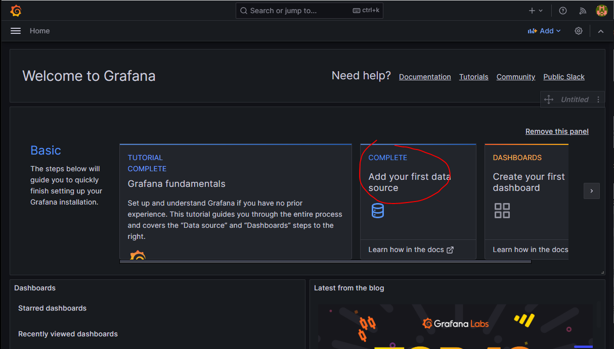
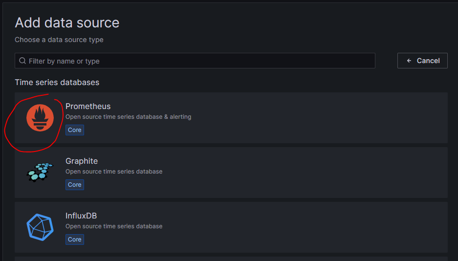
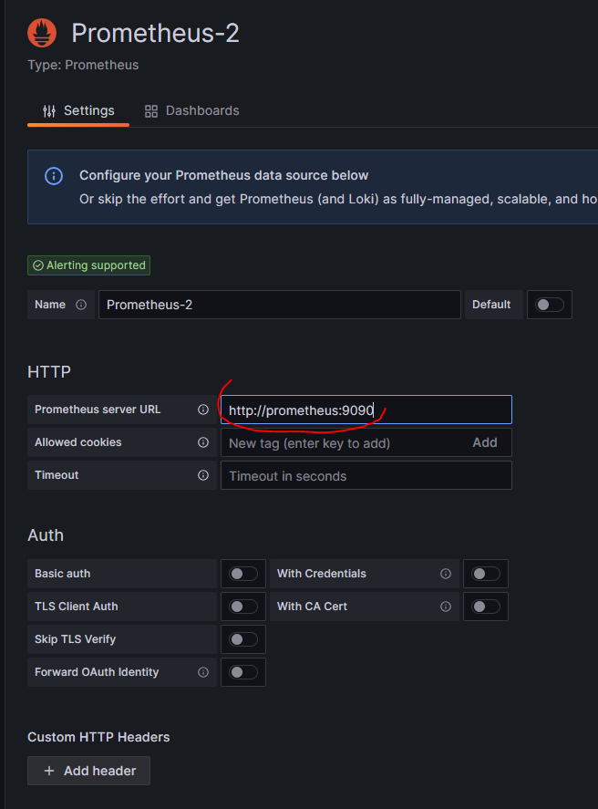
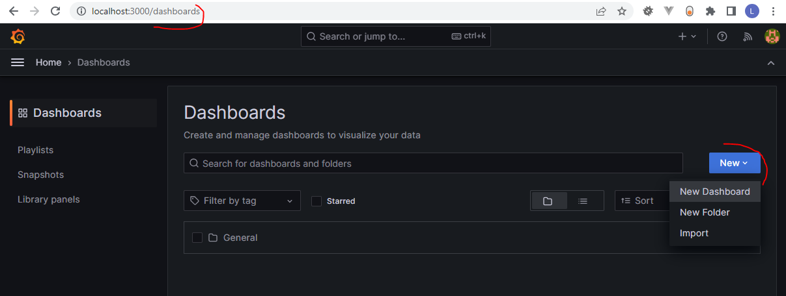
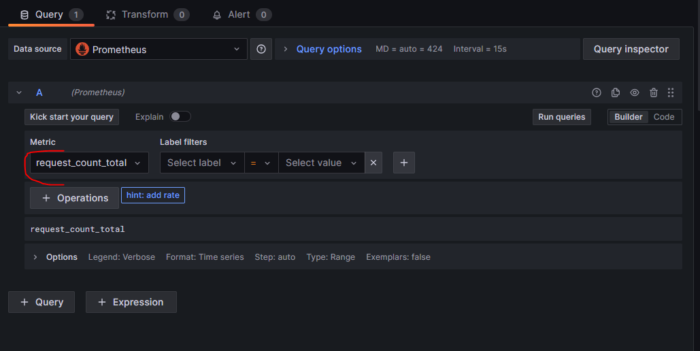
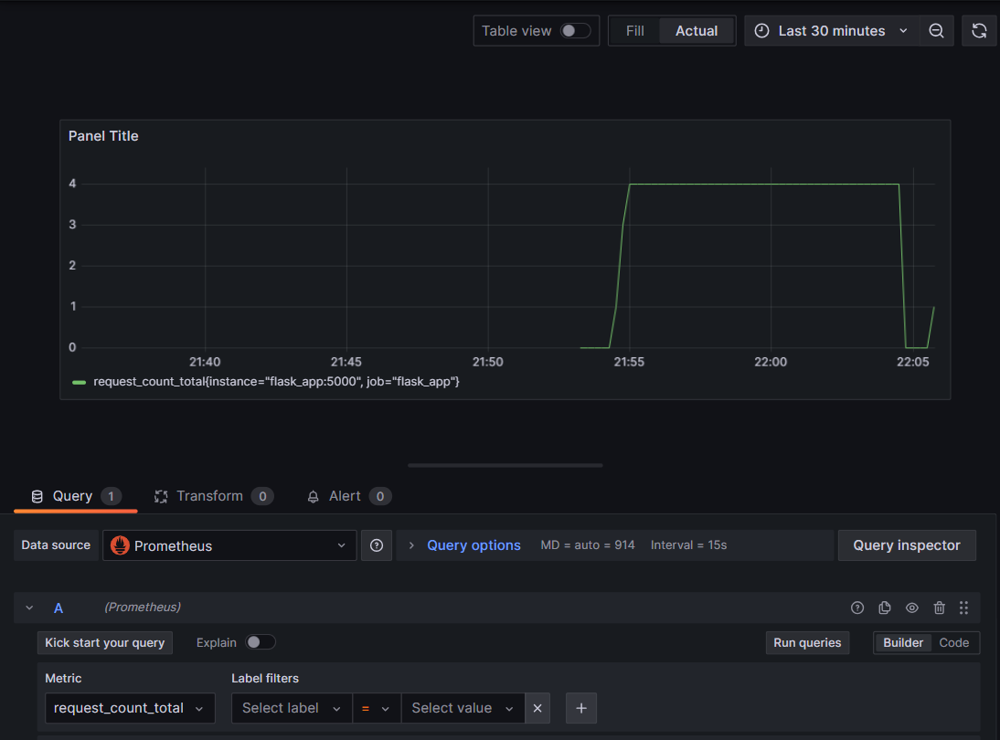
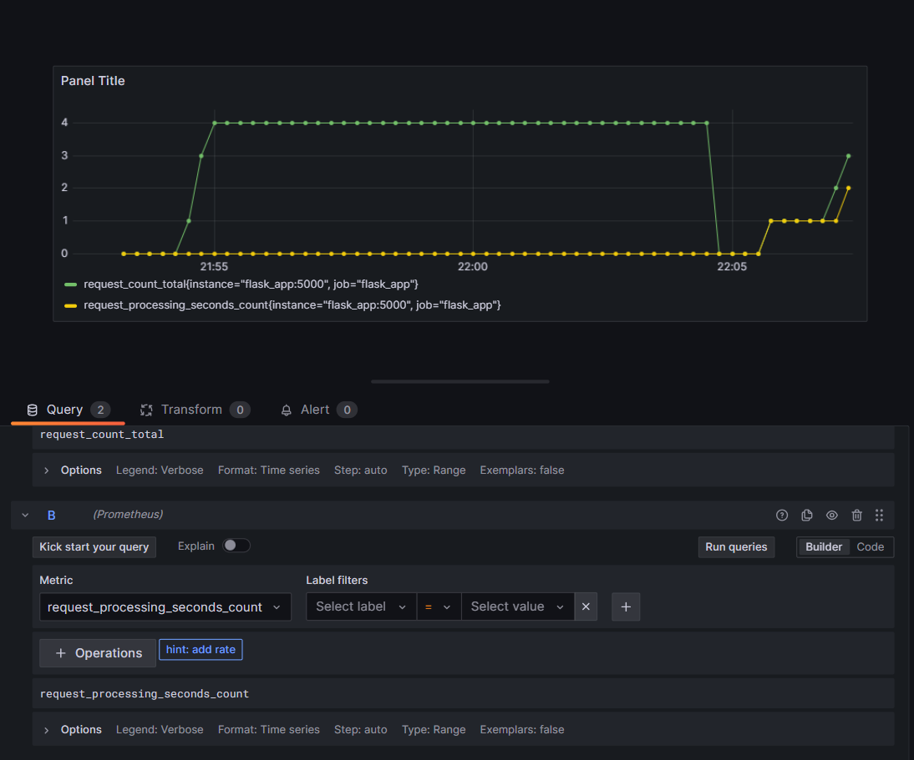

# {{ $frontmatter.title }}

## Tasks
* Setup Monitoring with Prometheus and Grafana
* Collect metrics from a Python Web Application (Flask)
* Visualize metrics in Grafana

## Intro
Service monitoring allows us to analyze specific events in our projects such as database calls, API interactions and requests, tracking resource performance, etc. 
You can easily detect unusual behaviour or discover useful clues behind the issues.
In this exercise, we will use Prometheus and Grafana to monitor a Python web application.
We are going to run all our services locally on Docker containers and use Docker Compose to orchestrate them.

## Setup the Project
First, we need to create a new directory for our project. You can name it whatever you want:
```bash
mkdir my-monitoring-exercise
cd my-monitoring-exercise
```

In the next steps we will create multiple files and directories. To give you a better overview, here is the structure of the project:
```shell
my-monitoring-exercise/
├── app/
│   ├── main.py
│   ├── Dockerfile
│   └── requirements.txt
├── prometheus/
│   └── prometheus.yml
└── docker-compose.yml
```

We will have a ``docker-compose.yml`` file to orchestrate our services in our root directory. Furthermore, we will have a directory for our Python web application and a directory for Prometheus.
The python app consists of a ``main.py`` file containing the Flask web application logic, a ``Dockerfile`` which describes how the Python app is build and run and a ``requirements.txt`` file, containing the Python dependencies.
The ``prometheus.yml`` file will be located in the Prometheus directory and will contain the configuration for Prometheus.

## Setting up Docker containers
Now create a ``docker-compose.yml`` file in the root directory and add the following content:
````yaml
version: "3.3"

services:
  prometheus:
    image: prom/prometheus
    ports:
      - "9090:9090"
    volumes:
      - ./prometheus/prometheus.yml:/etc/prometheus/prometheus.yml
    command:
      - '--config.file=/etc/prometheus/prometheus.yml'

  grafana:
    hostname: grafana
    image: grafana/grafana
    ports:
      - "3000:3000"
    environment:
      - GF_SECURITY_ADMIN_USER=admin
      - GF_SECURITY_ADMIN_PASSWORD=admin
    volumes:
      - grafana_data:/var/lib/grafana

  flask_app:
    build:
      context: .
      dockerfile: ./app/Dockerfile
    ports:
      - "5000:5000"
      - "8000:8000"

volumes:
  grafana_data:
````
We are defining three services: Prometheus, Grafana and our Python web application.
The most important point above configuration is ``prometheus.yml`` file mounting from our local to the docker container.
This file includes configuration for pulling data (metrics) from our app service or Python project. Without the file, you won't able to see the custom metrics that your project includes.

::: tip Learning Diary Exercise
Take a minute to understand what is happening here and discuss it in your Learning Diary submission.
* Where are the Services running?
* What will be the order of the services? (Which service will be started first? Why?)
* Research configurations and commands you don't know yet - write your lessons learned in your Learning Diary
:::

## Setting up Prometheus
Now create a ``prometheus.yml`` file in the ``prometheus`` directory and add the following content:
````yaml
global:
  scrape_interval: 15s # when Prometheus is pulling data from exporters etc
  evaluation_interval: 30s # time between each evaluation of Prometheus' alerting rules

scrape_configs:
  - job_name: flask_app   # your project name
    static_configs:
      - targets:
          - flask_app:8000
````
This configuration file tells Prometheus to pull data from the ``app`` service on port ``5000`` every 15 seconds.
The ``job_name`` is the name of your project. You can name it whatever you want.

## Setting up the Python Web Application
Now create a ``main.py`` file in the ``app`` directory and add the following content:

````python
from prometheus_client import start_http_server, Summary, Counter,generate_latest
from flask import Flask
import random
import time

app = Flask(__name__)

# Create a metric to track time spent and requests made.
REQUEST_TIME = Summary('request_processing_seconds', 'Time spent processing request')
REQUEST_COUNT = Counter('request_count', 'Total number of requests received')

# Decorate function with metric.
@REQUEST_TIME.time()
def process_request_time(t):
    """A dummy function that takes some time."""
    time.sleep(t)


@app.route('/')
def process_request_cnt():
    # Process the request logic here

    # Increment the request count metric
    REQUEST_COUNT.inc()

    # Simulate random request processing time
    processing_time = random.uniform(0, 5)
    process_request_time(processing_time)

    # Return the response
    return 'Request processed successfully'

@app.route('/metrics')
def handle_metrics():
    # Expose the metrics for scraping
    return generate_latest()

if __name__ == '__main__':
    # Start up the server to expose the metrics.
    start_http_server(8000)

    # Start the Flask app
    app.run(host='0.0.0.0', port=5000)
````

This is a simple Flask web application that exposes a single endpoint at ``localhost:5000``.
To collect metrics from our application, we are using the [prometheus_client](https://github.com/prometheus/client_python) library, which is a Python client for Prometheus.
We are defining two metrics: ``request_processing_seconds`` and ``request_count`` that will be used to track the time spent processing requests and the total number of requests received.
The ``process_request_time`` function is decorated with the ``@REQUEST_TIME.time()`` decorator, which will track the time spent processing requests.
The ``process_request_cnt`` function increments the ``request_count`` metric by one for each request received.
Those metrics will be exposed at ``localhost:8000`` for our Prometheus service to collect them.

Now, let's create a ``Dockerfile`` and ``requirements.txt`` to build our project.

**Dockerfile**

````dockerfile
# Base image
FROM python:3.9-slim

# Set the working directory
WORKDIR /app

# Copy the application code
COPY /app .

# Install dependencies
RUN pip install --no-cache-dir -r requirements.txt

# Expose the port on which the Flask app runs
EXPOSE 5000
# Expose the port from prometheus_client metrics
EXPOSE 8000

# Set the entry point command
CMD ["python", "main.py"]
````

::: tip Learning Diary Exercise
Take a minute to understand what is happening here and discuss it in your Learning Diary submission.
* What is the base image?
* What is the working directory?
* What is the entry point command?
* Research configurations and commands you don't know yet.
:::

**requirements.txt**

````text
Flask==2.0.1
prometheus_client==0.11.0
````

To start the services run the following command in the **root directory**:

````shell
docker-compose up -d
````

This will start the services in the background. You can check the status of the services with the following command:

````shell
docker-compose ps
````

Now you should be able to access the 3 services in your browser:
* Grafana: http://localhost:3000
* Prometheus: http://localhost:9090
* Python Web App: http://localhost:5000

### Setting up Grafana
In this section, we will use the Prometheus as a data source to show metrics in Grafana charts.

Navigate to ``localhost:3000`` to see the Grafana login page and use ``admin`` both for username and password. 
Then it will require adding a new password and we can keep it the same as it is since we're testing locally.

After successful login, we should see the default dashboard of Grafana and select Data Sources from the page.



Next, we need to add Prometheus as a data source. Click on the Add data source button and select Prometheus from the list.



Now we need to configure Prometheus as a data source. Under `URL` enter `http://prometheus:9090` which is the docker service name that we created.
We can use the default values for all other settings. Finally, click on the Save & Test button to save the data source.



Now our Grafana is ready to illustrate the metrics that come from Prometheus.
Let's now navigate to ``http://localhost:3000/dashboards`` to create a new dashboard. 
Click ``New`` and then ``New Dashboard`` for initialization:



Afterwards click on the ``Add visualization`` button and select your Prometheus data source.

In the ``Query`` panel, we can write our queries to get the metrics from Prometheus. Select ``request_count_total`` to query the number of requests received by our application.
Then click on the ``Run queries`` button to see the results:



To simulate some requests, open a new browser tab and navigate to ``http://localhost:5000``. Each time you refresh the page, the number of requests will increase by one.
> Note: it may take a few seconds for the metrics to be updated in Grafana.



Next, add nother visualization and select ``request_processing_seconds_count`` to query the time the requests spent processing.
Then click on the ``Run queries`` button to see the results:



> Note: to better see the results you can change the time range to ``Last 5 minutes``.


::: tip Learning Diary Exercise
Take a minute to understand what the graphs are showing and why. Find out how the ``main.py`` file is connected to the graphs and discuss it in your Learning Diary submission.
:::

## Submission
* Learning Diary in Moodle
* Discuss the topics from the tutorial and your personal lessons learned in the Learning Diary.