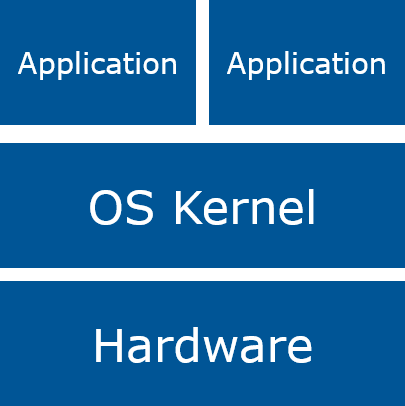
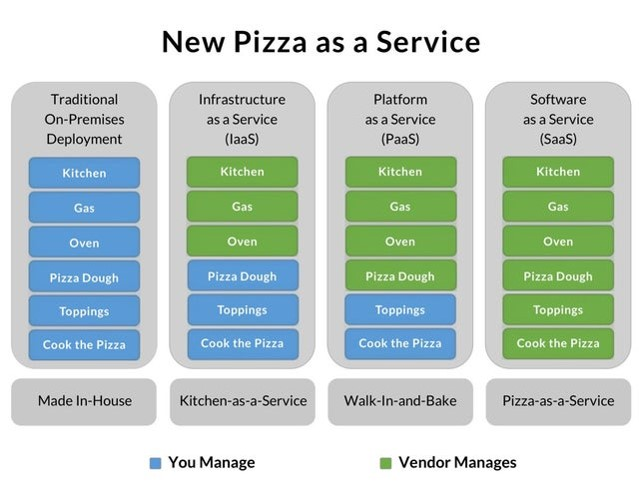
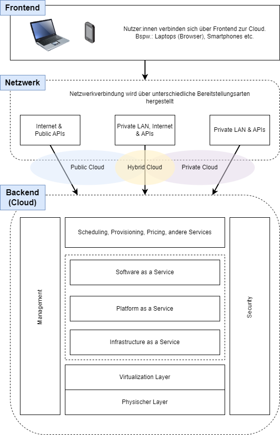
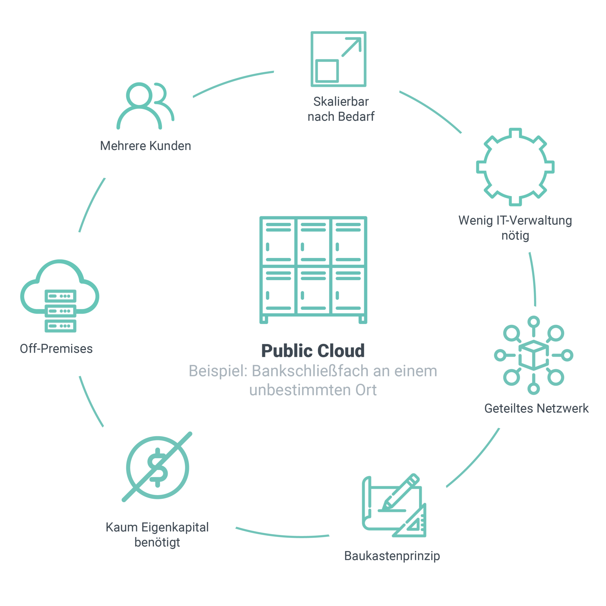
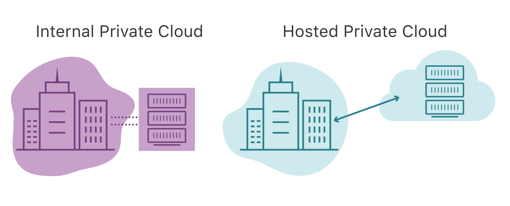
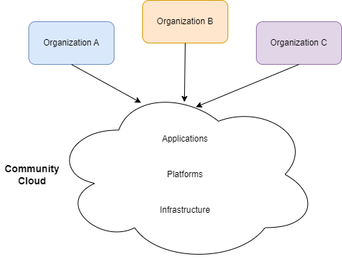
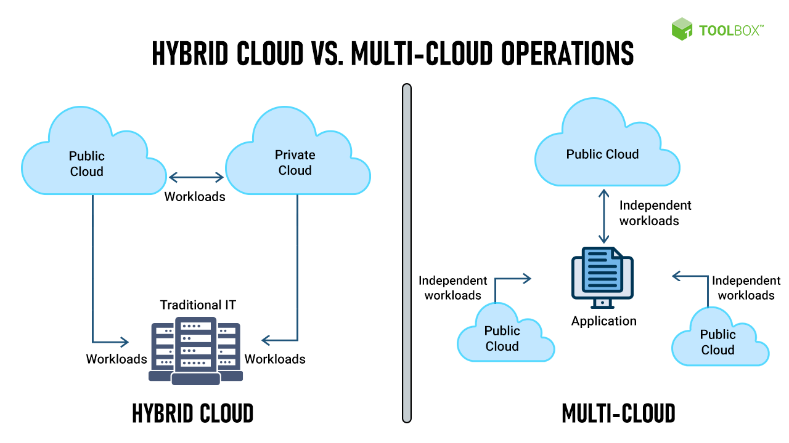

# Einführung in Cloud Computing

> "The cloud is just somebody else's computer."

In den letzten Jahren hat sich das Thema Cloud Computing zu einem der wichtigsten und revolutionärsten Konzepte in der IT-Branche entwickelt. Cloud Computing ermöglicht es Unternehmen und Privatpersonen, auf eine Vielzahl von IT-Ressourcen zuzugreifen, darunter Speicherplatz, Rechenleistung, Software und Anwendungen, über das Internet. Diese Ressourcen werden nicht mehr lokal auf physischen Geräten gespeichert, sondern in entfernten Rechenzentren, die über das Internet verbunden sind.

Cloud Computing ist keine magische Lösung, die automatisch alle Probleme traditioneller Infrastrukturen löst. In dieser Einheit werden wir uns eingehend mit den Grundlagen des Cloud Computing und den Charakteristiken der Cloud befassen. Es ist wichtig zu verstehen, dass Cloud Computing kein Allheilmittel ist, sondern eine Technologie, die eine sorgfältige Planung und Implementierung erfordert. Durch das Erlernen der Grundlagen und das Bewusstsein für mögliche Stolperfallen können wir die Vorteile der Cloud besser nutzen und gleichzeitig potenzielle Risiken minimieren.

## Motivation
Der Trend zum Cloud Computing kann nicht auf eine einzige technologische oder architektonische Entwicklung zurückgeführt werden. Vielmehr ist er das Ergebnis einer kumulativen Wirkung verschiedener Fortschritte in den Bereichen Mikroprozessoren, Speicher- und Netzwerktechnologien sowie Architekturen. Gleichzeitig wurden auch Softwaresysteme, Werkzeuge, Programmiersprachen und Algorithmen verbessert, um das verteilte und parallele Rechnen zu unterstützen. Diese Faktoren haben letztendlich dazu beigetragen, dass das Cloud Computing zu dem wurde, was es heute ist.

[Amazon Web Services](https://aws.amazon.com/) gilt als erster und bisweilen erfolgreichster Cloud-Service Anbieter. Im Jahr 1995 startete Amazon als eine Online-Buchhandlung. Im Laufe der Zeit erweiterte das Unternehmen sein Sortiment und begann neben Büchern auch Musik, Filme, Haushaltswaren, Elektronik, Spielzeug und eine Vielzahl anderer Produkte anzubieten. Dabei fungierte Amazon entweder selbst als Verkäufer oder als Vermittler zwischen anderen Einzelhändlern und seinen Kunden.

Amazon erkannte frühzeitig, dass nur etwa 10% seiner Kapazität oder Infrastruktur effektiv genutzt wurden, während die restlichen 90% ungenutzt blieben. Um diese ungenutzte Kapazität zu nutzen, entschied das Unternehmen, sie an seine Kunden zu verkaufen. Gleichzeitig erkannte Amazon, dass kleine und mittlere IT-Unternehmen oft vor der Herausforderung standen, **hohe Kapitalkosten** zu tragen. Diese Kosten beinhalten Gebäude-, Strom-, Computer-, Speicher-, Netzwerkhardware- und Softwareausgaben. Darüber hinaus erforderte der Start eines Geschäfts in der Regel einen **erheblichen Zeitaufwand** von mehreren Monaten. Die meisten **kleinen und mittleren Unternehmen** konnten diese anfänglichen Kosten nicht stemmen. Amazon erkannte die Bedürfnisse dieser Unternehmen und entwickelte im März 2006 seinen Simple Storage Service (S3), der als Datenlagerungsdienst über das **Internet** angeboten wurde. Damit konnten Unternehmen Speicherplatz als Dienstleistung nutzen, ohne hohe Vorlaufkosten und langwierige Vorbereitungen investieren zu müssen. Amazon ist verantwortlich für das **Pay-per-Use-Preismodell**, das heute als De-facto-Standard für Cloud-Preise gilt. Darüber hinaus erweiterte Amazon im August 2006 seine Elastic Compute Cloud (EC2), um Rechenleistung zu vermieten.

Im Jahr 2008 führte Google die [Google App Engine](https://cloud.google.com/appengine) ein, ein Entwicklertool, das es Nutzern ermöglicht, ihre Webanwendungen auf der Google Plattform auszuführen. Im Jahr 2009 brachte Microsoft [Azure](https://azure.microsoft.com/) auf den Markt, eine Cloud-Lösung, die darauf abzielt, Anwendungen und Dienste über das Internet zu erstellen, zu testen, bereitzustellen und zu verwalten.

Die Motivation hinter Cloud Computing besteht darin, die Rechenressourcen der Cloud-Anbieter effizient zu nutzen, indem diese Ressourcen als Service (ähnlich wie Strom oder Flüssiggas) an Organisationen oder Einzelpersonen vermietet werden. Dies ermöglicht es den Nutzern, Rechenleistung, Speicherplatz und andere Ressourcen bedarfsgerecht und flexibel zu nutzen, ohne hohe Investitionskosten für eigene Infrastrukturen tätigen zu müssen. Der Zugriff auf diese Ressourcen erfolgt über das Internet, was eine einfache Skalierung und Fernzugriff ermöglicht.

*Cloud Computing Timeline 1960-2005. Source: [bcs](https://www.bcs.org/articles-opinion-and-research/history-of-the-cloud/)*

*Cloud Computing Timeline 2005-2020. Source: [bcs](https://www.bcs.org/articles-opinion-and-research/history-of-the-cloud/)*

## Definition
Das [National Institute of Standards and Technology](https://www.nist.gov/)(NIST), definiert die Cloud wie folgt: 
> "A model for enabling ubiquitous, convenient, on-demand network access to a shared pool of configurable computing
resources that can be rapidly provisioned and released with minimal management effort or service provider interaction."

::: tip <h4>Charakteristiken des Cloud Computing Modells</h4>
**On-demand Self-Service**
  * Änderung von Ressourcen und Services ohne Interaktion mit dem Service-Provider

**Broad Network Access**
  * Services sind standardisiert über das Internet verfügbar

**Resource Pooling**
  * Ressourcen liegen in einem Pool des Providers
  * Anwender wissen nicht, wo sich Ressourcen befinden
  * Manches kann vertraglich vereinbart warden (Region, Land, Rechenzentrum)

**Rapid Elasticity**
  * Services werden schnell oder automatisch zur Verfügung gestellt
  * Ressourcen scheinen “unendlich”

**Measured Service**
  * Ressourcennutzung kann gemessen und überwacht werden
:::

## Grundlegende Technologien
Im Cloud Computing gibt es verschiedene grundlegende Technologien, die zur Realisierung und Bereitstellung der Cloud-Dienste verwendet werden:

**Hardwarekomponenten**: Server und Rechenzentren spielen eine entscheidende Rolle als Hardwarekomponenten im Cloud Computing. **Server** sind leistungsstarke Computer, die in **Rechenzentren** betrieben werden und für die Bereitstellung von Cloud-Diensten verantwortlich sind. Sie stellen die **physische Infrastruktur** bereit, auf der Anwendungen und Daten in der Cloud gehostet werden. **Rechenzentren** sind speziell konzipierte Einrichtungen, die eine Vielzahl von Servern und anderen IT-Infrastrukturen beherbergen. Sie sind mit modernster Technologie ausgestattet, um eine optimale Leistung, Sicherheit und Zuverlässigkeit zu gewährleisten. Zusammen bilden Server und Rechenzentren die Hardwaregrundlage des Cloud Computing. Sie ermöglichen die Virtualisierung, Skalierbarkeit und Elastizität, die es den Cloud-Anbietern ermöglichen, Ressourcen und Dienste effizient zu nutzen und den Benutzern flexible und skalierbare Lösungen anzubieten.

**Virtualisierung**: Virtualisierung ist eine Schlüsseltechnologie im Cloud Computing. Sie ermöglicht es, physische Ressourcen wie Server, Speicher und Netzwerke in virtuelle Instanzen zu unterteilen, die unabhängig voneinander betrieben werden können. Dadurch können mehrere virtuelle Maschinen (VMs) oder Container auf einem einzigen physischen Server laufen, was die Ressourcenauslastung erhöht und die Effizienz verbessert.

**Skalierbarkeit und Elastizität**: Cloud Computing bietet die Möglichkeit, die Ressourcenbedürfnisse flexibel anzupassen. Skalierbarkeit ermöglicht es, Ressourcen bei Bedarf hochzuskalieren, um Spitzenlasten zu bewältigen, und sie bei geringer Auslastung herunterzuskalieren, um Kosten zu optimieren. Elastizität bezieht sich auf die Fähigkeit, Ressourcen automatisch und dynamisch anzupassen, basierend auf dem tatsächlichen Bedarf. Technologien, die für die Skalierung und Elastizität eingesetzt werden sind u.a. Load Balancer, die eingehenden Traffic auf mehrere Ressourcen verteilen, Orchestrierungstools wie [Kubernetes](https://kubernetes.io/de/) und [Docker-Swarm](https://docs.docker.com/engine/swarm/), die Container und VM-Instanzen automatisiert bereitstellen und entfernen.

**Netzwerktechnologien**: Cloud Computing basiert auf umfangreichen Netzwerkinfrastrukturen, die eine sichere und zuverlässige Kommunikation zwischen Benutzern und Cloud-Diensten ermöglichen. Hier kommen Technologien wie **Virtual Private Networks (VPN), Software-Defined Networking (SDN)** und **Load Balancing** zum Einsatz, um den Datenverkehr zu verwalten und eine effiziente Verteilung von Ressourcen zu ermöglichen.

**Datenmanagement**: Cloud Computing erfordert effektive Technologien zum Speichern, Verwalten und Abrufen von Daten. Hier kommen verschiedene Datenbanktechnologien zum Einsatz, einschließlich relationaler Datenbanken, NoSQL-Datenbanken und Big-Data-Technologien wie Hadoop und Spark. Datenreplikation und -synchronisationstechniken gewährleisten die Verfügbarkeit und Konsistenz der Daten in einer verteilten Umgebung.

**Sicherheit**: Da Daten und Anwendungen in der Cloud gespeichert und übertragen werden, ist Sicherheit von entscheidender Bedeutung. Verschiedene Sicherheitstechnologien wie Verschlüsselung, Zugriffskontrolle, Firewall und Intrusion Detection Systems (IDS) werden eingesetzt, um die Datenintegrität, Vertraulichkeit und Verfügbarkeit in der Cloud zu gewährleisten.

## Limitierungen
Obwohl Cloud Computing viele Vorteile bietet, gibt es auch einige Limitierungen und Herausforderungen, die beachtet werden müssen:

**Internetverbindung**: Cloud Computing basiert auf dem Zugriff auf Dienste und Ressourcen über das Internet. Daher ist eine stabile und zuverlässige Internetverbindung erforderlich. Bei einer Unterbrechung der Internetverbindung oder langsamen Verbindungen kann die Verfügbarkeit und Leistung der Cloud-Dienste beeinträchtigt werden.

**Datensegregation**: Cloud Computing zeichnet sich durch die Eigenschaft der Multi-Tenancy aus, was bedeutet, dass auf demselben physischen Server virtuelle Maschinen verschiedener Kunden untergebracht werden können. In solchen Szenarien kann es schwierig sein, die Speicherisolierung zwischen zwei Benutzern aufrechtzuerhalten, wodurch das Risiko besteht, dass Daten von einer virtuellen Maschine auf eine andere "durchsickern".

**Sicherheits- und Datenschutzbedenken**: Die Auslagerung von Daten und Anwendungen in die Cloud bringt Sicherheits- und Datenschutzbedenken mit sich. Kunden müssen sicherstellen, dass ihre sensiblen Daten angemessen geschützt und vor unbefugtem Zugriff geschützt sind. Die Sicherheitsstandards und -maßnahmen des Cloud-Anbieters müssen daher sorgfältig geprüft und bewertet werden.

**Vendor Lock-in**: Kunden, die Cloud-Dienste nutzen, sind stark von ihren Cloud-Anbietern abhängig. Wenn ein Anbieter die Dienste einstellt oder Probleme hat, kann dies Auswirkungen auf die Verfügbarkeit und Kontinuität der Dienste haben. Es ist wichtig, Verträge und **Service Level Agreements (SLAs)** sorgfältig zu prüfen und sicherzustellen, dass angemessene Maßnahmen zur Kontinuität und zum Datenzugriff festgelegt sind.

**Datenübertragung und Latenz**: Das Übertragen großer Datenmengen in die Cloud oder das Abrufen von Daten aus der Cloud kann je nach Internetverbindung und Datenmenge zeitaufwendig sein. Dies kann zu Latenzproblemen führen, insbesondere wenn schnelle Reaktionszeiten erforderlich sind.

**Kosten und Abrechnung**: Obwohl Cloud Computing Kosteneinsparungen ermöglichen kann, sollten die Kosten sorgfältig bewertet und überwacht werden. Kunden sollten die Preismodelle der Cloud-Anbieter verstehen, um unerwartete Kosten zu vermeiden. Die Skalierbarkeit der Ressourcen kann zu variablen Kosten führen, die bei einer unzureichenden Verwaltung zu höheren Ausgaben führen können.

## Was ist ein Server?

Der Begriff **Server** hat in der Informatik zwei unterschiedliche Ausprägungen:
- **Server als Software**: ein Computerprogramm, das mit einem Clientprogamm (Client-Server-Architektur) kommuniziert und dabei bestimmte Services zur Verfügung stellt (bspw. Netzwerkverbindung, Auslesen von Files, Verarbeitung von Daten)
- **Server als Hardware**: ein Computer, auf dem ein oder mehrere Serverprogramme laufen

In den 1980er Jahren war der Unterschied zwischen Servern und den typischen Arbeitscomputern noch enorm. Einerseits durch ihr Äußeres (Gewicht, Form), aber auch durch ihre Architektur ([SPARC](https://en.wikipedia.org/wiki/SPARC), [Power](https://en.wikipedia.org/wiki/IBM_POWER_microprocessors)). 
Bei PCs kam vorwiegend die [x86](https://en.wikipedia.org/wiki/X86) Architektur zur Anwendung.

*Der erste Server des WWW am CERN. Source: [Wikipedia](https://de.m.wikipedia.org/wiki/Datei:First_Web_Server.jpg)*

Über die Jahre konnte sich die x86 Architektur jedoch auch in der Server-Landschaft durchsetzen. Dadurch wurden die Architekturen von PCs und Servern immer ähnlicher. In der Theorie heißt das, dass eine Kopie einer Maschine erstellt werden kann und auch (ohne aufwendige Anpassungen) auf einem Server laufen könnte.

Eine Ausnahme unter den Architekturen stellt nur die [ARM](https://en.wikipedia.org/wiki/ARM_architecture) Architektur dar, die ab Mitte der 90er Jahre mehr Verwendung fand. Die ARM Architektur ist heute vor allem am Smartphone und Tablet Markt weit verbreitet, da sie energiesparender ist.

> **Energieverbrauch** 
> 
> Aus der Perspektive der Home-PCs Nutzung macht es wahrscheinlich keinen großen Unterschied, ob ein Computer 200 oder 300 Watt verbraucht. Aus der Sicht eines Datacenters, mit mehreren hunderten bis tausenden Servern, kann das Einsparen von wenigen Prozent jedoch enorme Auswirkungen auf die Kosten haben.

Der äußerliche Unterschied von PCs und Servern blieb über die Jahre aber bestehen. Während die meisten Home-PCs als eine Art &ldquo;tower&rdquo; gebaut werden, wird bei Servern eines Datacenters eine flache Form bevorzugt. Das dient dazu, dass mehrere Server in sogenannten **Server-Racks** gestapelt werden können. 

*HP Proliant G5 Server, der aus dem Rack gezogen wurde. Source: [Wikipedia](https://en.wikipedia.org/wiki/ProLiant#/media/File:Proliant380g5_3.jpeg)*

> Server-Racks sind so konzipiert, das ganze Server oder Teile dieser, ausgetauscht werden können, ohne den Betrieb einzuschränken.

Server verfügen auch über ein hohes Maß an **Redundanz**. Während ein Heimcomputer vielleicht nur ein einziges Netzteil hat, verfügen Server in der Regel über zwei, die von verschiedenen Stromeingängen gespeist werden können. Dadurch wird sichergestellt, dass der Server auch dann weiterläuft, wenn eines der beiden Netzteile ausfällt oder einer der beiden Stromeingänge nicht funktioniert.

Meist können Server auch **remote** gewartet werden, selbst wenn die Server ausgeschaltet sind. Diese Funktion wird von unterschiedlichen Herstellern meist unterschiedlich bezeichnet (u.a. Out-of-Bounds-Management Interface, Dell Remote Access Control). Dabei dient das OOBM Interface auch der Überwachung mehrerer tausend Maschinen.

Auch der **Server-Kauf** muss gut geplant werden. Meist neigen größere Unternehmen dazu, dieselbe Hardware über längere Zeiten zu nutzen. Weiters wird auch der Support meist zusätzlich gekauft. Der Kauf eines bestimmten Komponentensatzes oder die Bestellung größerer Mengen von Servern stellt eine logistische Herausforderung dar und kann manchmal bis zu 3-4 Monate dauern. Der Kauf von Hardware ist außerdem eine Vorabinvestition, die bei sich schnell ändernden Anforderungen schwer zu rechtfertigen ist.

::: tip Zusammenfassung
* Server werden in Server-Racks gestapelt
* Teile des Servers sind leicht austauschbar und oft redundant verbaut
* Server können Remote gewartet werden (Out-of-Bounds Management)
* Kauf eines Servers ist eine große und langfristige Investition
:::

## Aufbau eines Rechenzentrums (Datacenter)
In Rechenzentren werden Server in Racks gestapelt und in Reihen angeordnet. Sie sind mit Hochgeschwindigkeitsnetzwerken verbunden, um den Datenverkehr zwischen den Servern zu ermöglichen und eine schnelle Kommunikation innerhalb des Rechenzentrums und mit externen Netzwerken zu gewährleisten. Rechenzentren werden nach strengen Standards für Sicherheit, Kühlung, Redundanz und Disaster Recovery betrieben, um die Verfügbarkeit der gehosteten Dienste sicherzustellen.

Da Server eine große Menge an Wärme erzeugen, darf ein **Kühlsystem** nicht fehlen. Für die Kühlung gibt es eine Vielzahl von Möglichkeiten, einige sind umweltfreundlicher als andere. Einige Rechenzentren entscheiden sich zum Beispiel für die Installation von Kaltluftschächten, bei denen kalte Luft zwischen zwei Rackreihen gepumpt und durch die Racks gepresst wird, um die Server zu kühlen.

*CERN Datacenter. Source: [CERN](https://home.cern/science/computing/data-centre)*

Neben der Kühlung ist auch die **Sicherheit** von großer Bedeutung. Je nach Umfeld ergeben sich unterschiedliche Sicherheitsanforderungen. So wird u.a. der Zutritt zu den Server Räumen kontrolliert. Je sicherheitskritischer desto mehr Vorkehrungen werden getroffen. Beispielsweise werden manche Server auch in Bunkern untergebracht, die Druckwellen, Hitze und Strahlung fernhalten sollen.

Auch dem **Brandschutz** wird ein besonderer Stellenwert eingeräumt. Dabei werden Löschanlagen bzw. Brandabschottungen zum Minimieren von Hardwareschäden installiert.

Alle **kritischen Systeme** in einem Rechenzentrum (Stromversorgung, Kühlung, Brandbekämpfungssysteme) sind in der Regel **redundant** ausgelegt, da der Ausfall eines dieser Systeme einen vollständigen Ausfall des Rechenzentrums bedeuten kann. Die Betreiber von Rechenzentren verfügen in der Regel auch über weitere Notfallpläne (z. B. ein USV-System (Batterie), Dieselgeneratoren, Tankwagen in Bereitschaft, eine Hotline für die Feuerwehr), um sicherzustellen, dass das Rechenzentrum die erforderliche Betriebszeit einhalten kann.

## Aufbau der Netzwerkinfrastruktur

Nachdem die physische Infrastruktur eingerichtet ist, stellt sich die Frage, wie eine Verbindung zum Internet hergestellt werden kann. Beim Aufbau von Netzwerken gibt es keine universelle Lösung, die für alle gleichermaßen gilt.

*Möglicher Aufbau einer Netzwerkinfrastruktur im Rechenzentrum Source: [Electronicspost](https://electronicspost.com/what-does-a-data-center-do/)*

Normalerweise werden Server-Racks mit einem Top-of-Rack (ToR) Switch ausgestattet [Layer 2 (Ethernet)](https://en.wikipedia.org/wiki/Data_link_layer) um eine Verbindung zwischen den Servern zu gewährleisten. Mehrere ToR Switches können dabei entweder an weitere Switches oder an einen Router geschalten werden. Der sogenannte Border Router [Layer 3 (IP)](https://en.wikipedia.org/wiki/Network_layer) ermöglicht dabei die Verbindung von externen Kunden mit internen Hosts über bspw. das Internet.

## Software Stack in der Cloud
Das übergeordnete **Ziel von Cloud Computing** ist das zur Verfügung stellen (Hosting) von **Applikationen**. Jeder Server hostet beispielsweise ein Betriebssystem (OS), welches zur Verwaltung der Server Hardware genutzt wird.
Dabei nutzt das Betriebssystem **Schnittstellen** (APIs - Application Programming Interfaces), damit die Hardwareressourcen verwendet werden können (über den sogenannten **Kernel**).

*OS Kernel*

Im Unterschied zum gewöhnlichen Software Stack mit einem Betriebssystem, bietet **Virtualisierung** die Möglichkeit, mehrere Gastbetriebssysteme (Hosts) effizient auf einem Server zur Verfügung zu stellen. Dabei werden die Hardwareressourcen gleichmäßig verteilt. Auf Virtualisierung wird in den folgenden Einheiten noch im Detail eingegangen.

*Virtualisierung*

### Laufzeitumgebung - Runtime Environment
Einige Applikationen benötigen für ihren Betrieb sogenannte Laufzeitumgebungen. Bspw. benötigen manche kompilierte Applikationen Zugriff auf *Shared Libraries*, welche von den Komponenten der Applikation wiederverwendet werden können. Laufzeitumgebungen finden sich meistens bei Applikationen, die in einer *Higher-Level Language* geschrieben sind, wie bspw. Java, Javascript (Node.js), PHP und C#.

*Laufzeitumgebung im Software Stack*

## Service Modelle
Je nachdem, welche IT-Ressourcen zur Verfügung gestellt werden, unterscheidet man bei Cloud-Computing verschiedene Servicemodelle.

*Pizza-as-a-Service: Erklärung der Service-Modelle anhand einer Pizzeria*

### Infrastructure as a Service (IaaS)
Das IaaS-Modell stellt Nutzer:innen **Speicher-, Rechen-, oder Netzwerkressourcen** zur Verfügung. Cloud-Speicher sind dabei aufgrund der weit verbreiteten Nutzung vor allem auch im privaten Bereich wohl die bekannteste Form dieses Servicemodells. Kommerzielle Anbieter stellen oft kostenlos Speicherplatz für Daten zur Verfügung. Geräte können sich via Netzwerk mit dem Server verbinden und Nutzer:innen die dort abgelegten Daten lesen, bearbeiten, synchronisieren, teilen und sichern.

Bsp.: Azure VM, AWS S3

### Platform as a Service - Managed Services (PaaS)
Das PaaS-Modell bietet Nutzer:innen eine Plattform für die Entwicklung und das Anbieten eigener Software-Anwendungen, indem Programmierungs- und Entwicklungsumgebungen flexibel zur Verfügung gestellt werden.

Bsp.: Heroku, Netlify, Force.com, Google App Engine, AWS Elastic Beanstalk

### Software as a Service (SaaS)
Dieses Servicemodell wird auch Software-on-Demand genannt und stellt Nutzer:innen Anwendungen zur Verfügung, die auf einer Cloud-Infrastruktur betrieben werden. 

Bsp.: Sharepoint, MS Teams, Zoom

*Cloud Service Modelle - (traditionelle) Übersicht*

## Geschäftsmodelle
Die Flexibilität der Cloud-Anbieter ergibt sich aus ihrer nutzungsabhängigen Preisgestaltung. Diese kann je nach Art des genutzten Dienstes variieren. Virtuelle Maschinen (IaaS) werden beispielsweise in der Regel auf Sekundenbasis abgerechnet. Wenn man eine virtuelle Maschine nur für 5 Minuten startet, zahlt man auch nur für 5 Minuten Laufzeit. So können die Nutzungskosten der Cloud optimiert werden, wenn Maschinen oder Dienste bei Bedarf automatisiert gestartet und gestoppt werden.
In der Regel werden die Kosteneinsparungen in folgenden Szenarien realisiert:

### On-off usage
* Maschinen starten nur wenn notwendig (Batch Processing)
* Bspw. Video konvertieren, ML Trainieren eines Modells

### Growth Usage
* Projekte die mit der Zeit wachsen (Startups etc.)
* Werden meist in die Cloud ausgelagert (Kauf von Servern – Kosten und Zeit!)

### Sudden spike usage
* Um “plötzliche” Applikations-Loads auszugleichen
* Bsp.: Freischaltung Impfanmeldung, Black Friday

### Periodic spike usage
* Unterschiedliche Spikes bspw. je Tageszeit oder Wochentag

### Vergleich On-Premises und Cloud

|      | Cloud                                                                                                               | On-Premises                                                                                                                           |
|------|---------------------------------------------------------------------------------------------------------------------|---------------------------------------------------------------------------------------------------------------------------------------|
| Pros | * Flexibilität    * Weniger Personalaufwand                                                                   | * Sehr gut anpassbar                                                                                                                   |
| Cons | * Potenzieller Vendor-Lock-in    * bei statischer Workload gleich teuer oder teurer   * Keine/Wenig Kontrolle | * Muss gut geplant werden (Vorabinvestition)   * Teuer bei dynamischen Workloads   * Hardware/Software Administration notwendig |

## Architektur der Cloud

Die Cloud-Architektur umfasst drei wesentliche Komponenten, die für die Umsetzung des Konzepts des Cloud Computing unerlässlich sind. Die drei Hauptkomponenten des Cloud Computing sind das **Frontend**, das **Netzwerk** und das **Backend** (die Cloud).

### Frontend
Die Frontend-Schicht der Cloud bezieht sich auf die Benutzer:innenebene. Typische Cloud-Nutzer sind Einzelpersonen, Unternehmen, Mitarbeitende von Unternehmen, mobile Benutzer:innen, usw. Cloud Service Provider stellen APIs und Schnittstellen zur Verfügung, über die die Nutzer:innen selbst auf den gewünschten Dienst über ein Webportal zugreifen können.

### Netzwerk
Das Netzwerk bezieht sich auf die umfangreiche Backbone-Infrastruktur, die von Cloud Service Providern genutzt wird, um ihre Services den Nutzer:innen zur Verfügung zu stellen. Das Internet stellt die zentrale Netzinfrastruktur dar, die Cloud Computing ermöglicht. In der Regel können Nutzer:innen direkt über das Internet auf öffentliche Clouds zugreifen, während der Zugriff auf private Clouds über ein sicheres VPN (Virtual Private Network) über das Internet erfolgt.

### Backend
Das Backend ist das Kernstück der Cloud und besteht aus 6 weiteren Komponenten: *Physische Schicht*; *Virtualisierungsschicht*; *Cloud Service Schicht*; *Scheduling, Provisioning und Pricing*; *Security* und *Management*.

**Physische Schicht**: Hardwarekomponenten wie Server, CPUs, Speichergeräte, Netzwerk Devices, Memory uvm. Die physische Schicht ist normalerweise nicht nur an einem sondern an mehreren geographischen Standorten verteilt.

**Virtualisierungsschicht**: Die Virtualisierungsschicht ist dafür zuständig, die gesamte Heterogenität und physische Verteilung der zugrunde liegenden Hardware zu berücksichtigen und eine einzige **logische Ansicht** für die gesamte physische Schicht der Cloud zu erzeugen. Dazu werden sogenannter Hypervisoren verwendet. Die virtualisierten Ressourcen werden anschließend auf die Nutzer:innen der Cloud verteilt.

**Cloud Service Schicht**: siehe Punkt *Service Modelle*

**Scheduling, Provisioning und Pricing**: Für die Verwaltung der Cloud Umgebung sind verschiedene Management- und Orchestrierungsdienste erforderlich. Ein Cloud-Orchestrator automatisiert und orchestriert
* Scheduling-Komponenten, um Ressourcen für verschiedene Mandanten zu planen
* Provisioning-Komponenten, die Ressourcen bereitstellen
* Monitoring-Komponenten, die die Cloud-Umgebung überwachen
* Metering-Services, die die bereitgestellten Ressourcen messen
* Preisgestaltungskomponente, die den Verbraucher:innen ein abonnementbasiertes oder nutzungsbasierten Modell abrechnet

**Security**: Für die Sicherheit beim Cloud Computing sind sowohl die Service Provider als auch die Cloud-Nutzer:innen verantwortlich. Bei IaaS beispielsweise sind die Anbieter für die Sicherheit ihrer physischen Infrastruktur verantwortlich und die Nutzer:innen für die Sicherheit des Gastbetriebssystems (OS), der Plattform, der Anwendungen und der Daten, die sie in der genutzten Infrastruktur einsetzen.

**Management**: Da die Cloud Umgebung komplex ist, verwenden die Service Provider verschiedene Tools zur Verwaltung, Automatisierung und Orchestrierung von Cloud-Prozessen und Services. Cloud Management Platform (CMP)-Tools, Cloud-Automatisierungs-Tools, Cloud-Orchestrierungs-Tools, Cloud-Überwachungs-Tools, Cloud-Sicherheits-Tools usw. werden in der Regel zur Verwaltung und Optimierung der Cloud eingesetzt.

## Deployment Modelle
Bei Cloud-Services unterscheidet man auch die verschiedenen Arten der Bereitstellung. Je nachdem von wem die Services angeboten werden und an welche Zielgruppe sie sich richten.

### Public Cloud
In der Public Cloud werden Services und Infrastruktur über ein öffentliches Netz (Internet) für alle Nutzer:innen mit einem Pay-per-Use Abo bereitgestellt. Die Services sind über öffentliche Schnittstellen (APIs) erreichbar. Nutzer:innen können notwendige Services über ein Web Interface, ohne Zutun des Service Provider, beziehen. Zu den Anbietern von öffentlichen Clouds gehören Google, Amazon, Microsoft, und Salesforce.com, die ihre Dienste (die IaaS, PaaS oder SaaS sein können) der Öffentlichkeit über das Internet anbieten. **Das inhärente Merkmal der Bereitstellung einer öffentlichen Cloud ist Mehrmandantenfähigkeit**. Die Cloud-Ressourcen sind gleichzeitig für mehrere Mandanten zugänglich. Intern werden die Ressourcen virtualisiert und auf mehrere Kund:innen aufgeteilt.

*Public Cloud am Beispiel eines Bankschließfachs. Source: [Innovations on](https://innovations-on.com/blog/1x1-public-cloud/)*

::: tip Vorteile
* Günstiger, da keine eigene Infrastruktur gekauft, installiert oder gewartet werden muss.
* Steigerung der Produktivität, da eigene Laufzeitumgebungen nicht verwaltet werden müssen.
* Dynamische Skalierung von Ressourcen
* Unlimitierte Kapazität zu geringem Preis
* Einsatz modernster Technologien und Hardware
* Universaler Zugang
* Automatische Backups und Recovery
:::

::: danger Nachteile
* Mehrmandantenfähigkeit, da sich mehrere Mandanten die physische Infrastruktur teilen, besteht ein erhöhtes Sicherheitsrisiko (gegenseitige Beeinflussung, Datenexpositionen).
* Ausfälle betreffen mehrere Mandanten und deren Applikationen.
* Eingeschränkter Zugriff und Kontrolle
* Nutzer:innen wissen meist nicht *wo* Daten genau verarbeitet und gespeichert werden.
* Mögliche Bruch von geltenden Sicherheits- und Datenschutz-Bestimmungen
:::

### Private Cloud
Für einige Anwendungsfälle ist der Zugang über das öffentliche Internet jedoch nicht erwünscht oder sogar durch Gesetze oder Vorschriften streng verboten. In anderen Fällen kann ein Unternehmen beschließen, dass bestimmte Systeme niemals mit dem öffentlichen Internet verbunden werden dürfen oder nur über ein selbst gehostetes Gateway zugänglich sind. Um das Risiko einer gegenseitigen Beeinflussung oder einer Datenexposition durch andere Kunden, die dieselbe Infrastruktur nutzen, zu minimieren. Solche Kreuzkontaminationen sind nicht ungewöhnlich. In den letzten Jahren gab es beispielsweise eine ganze Reihe von CPU-Fehlern wie [Meltdown](https://de.wikipedia.org/wiki/Meltdown_(Sicherheitsl%C3%BCcke)) und [Spectre](https://de.wikipedia.org/wiki/Spectre_(Sicherheitsl%C3%BCcke)).

Eine private Cloud wird von einer einzigen Organisation verwaltet. Services werden den Nutzer:innen über ein privates LAN und ein Self-Service-Portal zur Verfügung gestellt. Private Clouds werden beispielsweise über Cloud Plattformen wie [OpenStack](https://www.openstack.org/) oder [Eucalyptus](https://www.eucalyptus.cloud/) betrieben, oder indem bereits virtualisierte Infrastruktur automatisiert und orchestriert wird. Eine private Cloud kann vom Unternehmen selbst, aber auch von Drittanbietern verwaltet werden.

*Internal und hosted Private Cloud. Source: [Cloudflare](https://www.cloudflare.com/de-de/learning/cloud/what-is-a-private-cloud/)*

::: tip Vorteile
* Kontrolle: Eine Private Cloud bietet volle Kontrolle über die Infrastruktur, Sicherheit und Compliance.
* Sicherheit: Private Clouds bieten in der Regel höhere Sicherheitsstandards als öffentliche Clouds, da sie nicht öffentlich zugänglich sind und von einem Unternehmen oder einer Organisation betrieben werden.
* Flexibilität: Unternehmen können die Private Cloud an ihre spezifischen Anforderungen anpassen und haben dadurch eine höhere Flexibilität bei der Skalierung und Anpassung der Infrastruktur.
* Leistung: Da die Private Cloud für eine spezifische Organisation oder ein Unternehmen bereitgestellt wird, kann sie optimiert werden, um höhere Leistungsstandards zu erfüllen.
:::

::: danger Nachteile
* Kosten: Private Clouds erfordern erhebliche Investitionen in die Infrastruktur, Wartung und Administration. Im Vergleich zu öffentlichen Clouds sind die Kosten für eine Private Cloud in der Regel höher.
* Skalierung: Die Skalierung der Private Cloud kann schwieriger sein als bei öffentlichen Clouds, da sie auf die Kapazitäten der physischen Infrastruktur beschränkt ist.
* Expertise: Private Clouds erfordern spezielle Kenntnisse und Fähigkeiten, um die Infrastruktur zu konfigurieren, zu warten und zu verwalten. Ein Unternehmen benötigt daher spezialisiertes Personal oder muss diese Fähigkeiten auslagern.
* Abhängigkeit: Private Clouds können zu einer erhöhten Abhängigkeit von einem bestimmten Anbieter führen, was die Flexibilität einschränken kann.
:::

### Community Cloud 
Eine Community Cloud ist ein Cloud-Modell, bei dem eine Infrastruktur und Services von mehreren Organisationen oder einer bestimmten Community gemeinsam genutzt werden. Im Gegensatz zur Public Cloud, die öffentlich zugänglich ist, und der Private Cloud, die für eine einzelne Organisation reserviert ist, richtet sich die Community Cloud an eine spezifische Gruppe von Organisationen mit gemeinsamen Interessen, Anforderungen oder regulatorischen Anforderungen. Beispielsweise eine Forschungs-Cloud mit spezieller Hardware oder ermäßigten Tarifen für mehrere Forschungsorganisationen oder Universitäten.

::: tip Vorteile
* Kostenersparnis: Durch die gemeinsame Nutzung der Infrastruktur und Ressourcen können die Organisationen einer Community Cloud die Kosten im Vergleich zu einer eigenen dedizierten Infrastruktur senken. Die Anschaffungs-, Wartungs- und Betriebskosten werden auf mehrere Organisationen verteilt.
* Sicherheit und Datenschutz: Community Clouds bieten oft höhere Sicherheitsstandards als öffentliche Clouds, da sie auf die spezifischen Anforderungen und Richtlinien der Community abgestimmt sind. Durch gemeinsame Sicherheitsmaßnahmen können Risiken minimiert und Datenschutz gewährleistet werden.
* Skalierbarkeit und Flexibilität: Eine Community Cloud ermöglicht es den Organisationen, Ressourcen und Services je nach Bedarf zu skalieren und anzupassen. Durch die gemeinsame Nutzung können sie auf eine größere Pool von Ressourcen zugreifen und ihre Kapazitäten flexibel anpassen.
* Zusammenarbeit und Wissensaustausch: Community Clouds fördern die Zusammenarbeit und den Austausch von Best Practices innerhalb der Community. Die Organisationen können von den Erfahrungen und Fachkenntnissen anderer Organisationen profitieren, was zu einer verbesserten Innovationsfähigkeit und Effizienz führen kann.
:::

::: danger Nachteile
* Begrenzte Kontrolle: Da die Infrastruktur und Services von mehreren Organisationen geteilt werden, haben die einzelnen Organisationen möglicherweise weniger direkte Kontrolle über ihre Ressourcen. Entscheidungen bezüglich der Infrastruktur, Konfiguration und Wartung müssen in Abstimmung mit anderen Organisationen getroffen werden.
* Abhängigkeit von anderen Organisationen: Eine Community Cloud setzt eine enge Zusammenarbeit und Koordination zwischen den Organisationen voraus. Wenn eine Organisation in der Community nicht in der Lage ist, ihren Verpflichtungen nachzukommen oder ausfällt, kann dies Auswirkungen auf die Verfügbarkeit und Leistung der Community Cloud haben.
* Einschränkungen bei der Anpassung: Da die Community Cloud auf die gemeinsamen Interessen und Anforderungen der Organisationen zugeschnitten ist, kann dies bedeuten, dass individuelle Anpassungen und spezifische Anforderungen möglicherweise nicht vollständig erfüllt werden können. Die Flexibilität kann in einigen Fällen begrenzt sein.
* Komplexität des Managements: Die Verwaltung einer Community Cloud erfordert eine effektive Koordination, gemeinsame Standards und eine klare Governance-Struktur. Dies kann zusätzliche Komplexität und Herausforderungen bei der Umsetzung und Verwaltung der Community Cloud mit sich bringen.
:::

### Hybrid Cloud
Eine hybride Cloud ist die Kombination von öffentlichen und privaten Cloud-Ressourcen in einer einzigen Infrastruktur ermöglicht. Es verbindet also Elemente der public Cloud und der privaten Cloud zu einer hybriden Umgebung.
In einer hybriden Cloud-Umgebung können Unternehmen und Organisationen bestimmte Anwendungen, Daten oder Workloads in der privaten Cloud betreiben, während sie andere in der öffentlichen Cloud hosten. Die beiden Cloud-Typen sind über ein Netzwerk miteinander verbunden und ermöglichen die nahtlose Datenübertragung und Interaktion zwischen ihnen. So laufen bestimmte Services bei öffentlichen Anbietern über das Internet, während datenschutzkritische Anwendungen und Daten im Unternehmen betrieben und verarbeitet werden. Die Herausforderung liegt hier in der Trennung der Geschäftsprozesse in datenschutzkritische und -unkritische Workflows. Voraussetzung ist eine saubere und konsequente Klassifizierung der im Unternehmen vorhandenen und verarbeiteten Daten.

::: tip Vorteile
* Flexibilität: Eine hybride Cloud ermöglicht es Unternehmen, flexibel zwischen privaten und öffentlichen Cloud-Ressourcen zu wechseln, je nach Bedarf und Anforderungen. Sie können Workloads und Daten zwischen den beiden Umgebungen verschieben, um die optimale Balance zwischen Kontrolle, Leistung und Skalierbarkeit zu erreichen.
* Skalierbarkeit: Unternehmen können die elastischen Skalierungsmöglichkeiten der öffentlichen Cloud nutzen, um Lastspitzen abzufangen und zusätzliche Ressourcen bei Bedarf bereitzustellen.
* Kostenoptimierung: Durch die Verwendung einer hybriden Cloud können Unternehmen Kosten optimieren, indem sie die teureren privaten Cloud-Ressourcen für geschäftskritische Anwendungen reservieren und nicht so sensible oder variable Workloads in der kosteneffizienteren öffentlichen Cloud betreiben.
* Datensicherheit und Compliance: Die hybride Cloud ermöglicht es Unternehmen, sensible Daten und Anwendungen in der privaten Cloud zu halten, wo sie eine höhere Kontrolle und Sicherheit haben. Dies ist besonders wichtig für Branchen mit strengen Compliance-Anforderungen oder Datenschutzbestimmungen.
* Technologische Flexibilität: Unternehmen haben die Freiheit, verschiedene Cloud-Plattformen, -Dienste und -Technologien zu kombinieren, um ihre spezifischen Anforderungen zu erfüllen. Sie können spezialisierte Dienstleistungen und Funktionen von verschiedenen Anbietern nutzen und sich an sich ändernde Technologielandschaften anpassen.
:::

::: danger Nachteile
* Komplexität: Die Integration und Verwaltung einer hybriden Cloud-Umgebung erfordert Fachkenntnisse und eine sorgfältige Planung, um sicherzustellen, dass die privaten und öffentlichen Cloud-Komponenten reibungslos zusammenarbeiten und effektiv verwaltet werden.
* Abhängigkeit von Netzwerkverbindungen: Da eine hybride Cloud eine Kombination aus privaten und öffentlichen Clouds ist, ist eine zuverlässige und leistungsfähige Netzwerkverbindung zwischen den beiden Umgebungen erforderlich. Eine instabile oder langsame Netzwerkverbindung kann die Leistung und Verfügbarkeit beeinträchtigen.
* Sicherheitsrisiken: Die hybride Cloud eröffnet zusätzliche Sicherheitsrisiken, insbesondere wenn Daten und Workloads zwischen privaten und öffentlichen Clouds übertragen werden. Es erfordert robuste Sicherheitsmaßnahmen, um sicherzustellen, dass sensible Informationen geschützt sind und Datenintegrität gewährleistet ist.
* Kompatibilitätsprobleme: Unterschiedliche Cloud-Plattformen und -Dienste können unterschiedliche Standards und Protokolle verwenden, was zu Kompatibilitätsproblemen führen kann. Die Integration und Interoperabilität zwischen den verschiedenen Cloud-Umgebungen erfordert möglicherweise zusätzliche Anpassungen und Integrationsschritte.
* Kosten- und Lizenzmanagement: Die Verwaltung und Verfolgung der Kosten und Lizenzen in einer hybriden Cloud-Konfiguration erfordert eine genaue Überwachung, um sicherzustellen, dass die Nutzung von Ressourcen und Diensten in Übereinstimmung mit den vereinbarten Vereinbarungen und Lizenzen erfolgt.
:::

### Multi Cloud
Die Multi-Cloud bezieht sich auf die Verwendung mehrerer Cloud Service Provider für die Bereitstellung von Services und Ressourcen. Es handelt sich um eine Strategie, bei der Unternehmen verschiedene Cloud-Anbieter nutzen, um ihre Anwendungen, Daten und Workloads in verschiedenen Cloud-Umgebungen zu hosten und zu verwalten.

Im Gegensatz zur Hybrid Cloud, bei der private und öffentliche Clouds kombiniert werden, konzentriert sich die Multi-Cloud auf die Nutzung von verschiedenen Cloud-Anbietern, unabhängig davon, ob es sich um öffentliche oder private Clouds handelt. Unternehmen können beispielsweise Amazon Web Services (AWS), Microsoft Azure, Google Cloud Platform (GCP) und andere Anbieter gleichzeitig verwenden.

*Hybrid vs. Multi Cloud. [Source](https://www.spiceworks.com/tech/cloud/articles/multi-cloud-vs-hybrid-cloud/)*

::: tip Vorteile
* Flexibilität und Auswahl: Unternehmen können die Services auswählen, die am besten ihren spezifischen Anforderungen und Bedürfnissen entsprechen.
* Ausfallsicherheit und Redundanz: Durch die Verwendung mehrerer Cloud-Anbieter und das Verteilen von Workloads auf verschiedene Clouds kann die Ausfallsicherheit verbessert werden. Wenn ein Anbieter oder eine Region Probleme hat, können Workloads nahtlos auf andere Clouds verschoben werden, um den Betrieb aufrechtzuerhalten.
* Vermeidung von Vendor-Lock-in: Die Multi-Cloud-Strategie verringert das Risiko eines Vendor-Lock-ins, da Unternehmen nicht von einem einzigen Anbieter abhängig sind. Sie haben die Möglichkeit, ihre Workloads und Daten auf verschiedene Clouds zu verteilen und bei Bedarf zwischen Anbietern zu wechseln.
* Optimierung der Kosten: Durch die Auswahl der kostengünstigsten Optionen für bestimmte Workloads oder Dienste aus verschiedenen Cloud-Anbietern können Unternehmen Kosten optimieren. Sie können die Preismodelle, Rabatte und Angebote der verschiedenen Anbieter nutzen, um die Kosten zu senken.
* Technologische Anpassungsfähigkeit: Unterschiedliche Cloud-Anbieter bieten unterschiedliche Technologien und Dienstleistungen an. Die Nutzung einer Multi-Cloud-Strategie ermöglicht es Unternehmen, die besten Technologien und Dienstleistungen für ihre spezifischen Anforderungen auszuwählen und zu nutzen.
:::

::: danger Nachteile
* Komplexität: Die Verwaltung und Integration mehrerer Cloud-Anbieter erfordert Fachkenntnisse und Ressourcen, um eine nahtlose Integration, Sicherheit und Effizienz zwischen den verschiedenen Clouds zu gewährleisten.
* Herausforderungen bei der Datenmigration und Integration: Das Bewegen von Daten und Anwendungen zwischen verschiedenen Clouds und deren Integration kann technische Herausforderungen mit sich bringen. Unterschiedliche Datenformate, Protokolle und Schnittstellen erfordern möglicherweise zusätzliche Anpassungen und Integrationsschritte.
* Sicherheitsrisiken: Die Nutzung mehrerer Clouds erhöht potenziell die Angriffsfläche und die Komplexität der Sicherheitsmaßnahmen. Unternehmen müssen sicherstellen, dass angemessene Sicherheitsvorkehrungen getroffen werden, um die Daten und Anwendungen in allen Cloud-Umgebungen zu schützen.
* Kosten- und Ressourcenmanagement: Die Verwaltung und Überwachung der Kosten und Ressourcen in einer Multi-Cloud-Umgebung kann herausfordernd sein. Unternehmen müssen sicherstellen, dass sie den Überblick über die Kosten, Nutzung und Performance behalten und effektives Ressourcenmanagement betreiben.
* Abhängigkeit von Netzwerkverbindungen: Die Multi-Cloud-Strategie erfordert eine zuverlässige und leistungsfähige Netzwerkverbindung zwischen den verschiedenen Cloud-Anbietern. Eine schlechte Netzwerkverbindung kann die Leistung und Verfügbarkeit der Cloud-Services beeinträchtigen.
:::

## Literatur
> * Surianarayanan and Chelliah, "Essentials of Cloud Computing", Springer Nature Switzerland, 2019
> * Dan C. Marinescu, "Cloud Computing, Theory and Practice", Third Edition, Morgan Kaufmann Publishers, 2023
> * B. Varghese and R. Buyya, “Next Generation Cloud Computing: New Trends and Research Directions,” Volume 79, Part 3, February 2018, pp. 849-861.
> * Haengkon Kim and Roger Lee, "Software Engineering in IoT, Big Data, Cloud and Mobile Computing", Studies in Computational Intelligence 930, Springer, 2021
> * Lisdorf Anders, "Cloud Computing Basics - A Non-Technical Introduction", Apress, 2021
> * Manvi Sunilkumar and Shyam Gopal Krishna, "Cloud Computing - Concepts and Technologies", CRC Press, 2021
