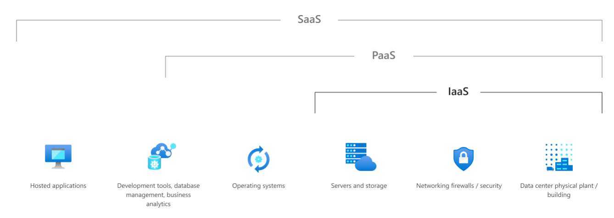
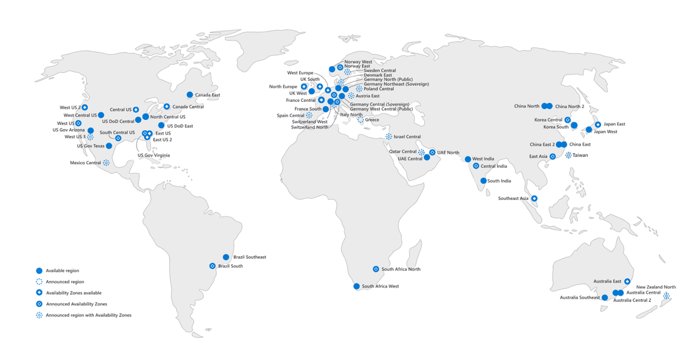
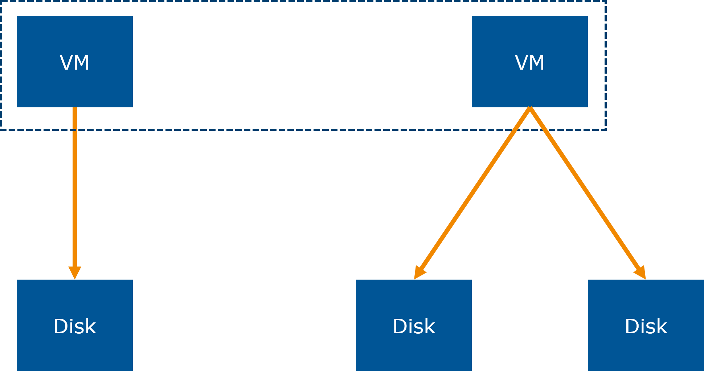
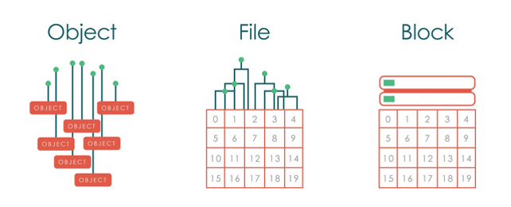

# {{ $frontmatter.title }}

## IaaS - Intro

Infrastructure as a Service (IaaS) ist ein Modell im Cloud Computing, bei dem Unternehmen **virtuelle Ressourcen** wie virtuelle Maschinen, Speicher, Netzwerke und andere grundlegende Infrastrukturelemente von einem Cloud-Anbieter bereitgestellt werden. Im IaaS-Modell ist der Cloud-Anbieter für die Verwaltung und Bereitstellung der physischen Infrastruktur verantwortlich, während die Kund:innen die Kontrolle und Verantwortung über die Konfiguration und Verwaltung der virtuellen Ressourcen behalten.

Im Wesentlichen stellt IaaS eine virtualisierte Computing-Infrastruktur über das Internet bereit. Unternehmen können diese Infrastruktur nutzen, um ihre Anwendungen, Daten und Workloads auszuführen, ohne selbst physische Hardware und Infrastruktur erwerben, verwalten und warten zu müssen.

Beispiele für IaaS-Anbieter sind Amazon Web Services (AWS) mit **Amazon Elastic Compute Cloud (EC2)**, Microsoft Azure mit **Azure Virtual Machines** und Google Cloud Platform (GCP) mit **Google Compute Engine**.

IaaS bietet Zugriff auf:
* **Netzwerkfunktionen** wie z.B. Anbindung an das Internet, virtuelle private Netzwerke (bspw. Verbindung zwischen VMs), Firewalls
* **Computer/Maschinen** wie z.B. virtuelle Maschinen (VMs), dedizierte Hardware
* **Storage**
* **Begleitende Dienste** wie Überwachung, Abrechnung, Sicherheit, Load Balancing, Clustering, Mechanismen für Ausfallsicherheit (Backups, Replikation, Wiederherstellung)

*IaaS als Service Modell des Cloud Computing. Source: [Azure](https://azure.microsoft.com/de-de/overview/what-is-iaas/#overview)*

## Was ist Virtualisierung?

Virtualisierung ist eine Technologie, bei der eine oder mehrere virtuelle Instanzen von Ressourcen oder Systemen auf einer physischen Infrastruktur erstellt werden. Sie ermöglicht die effiziente Nutzung von Hardware-Ressourcen, indem sie diese auf mehrere virtuelle Umgebungen aufteilt, die unabhängig voneinander betrieben und verwaltet werden können.

Die Virtualisierung kann auf verschiedenen Ebenen stattfinden, einschließlich Server-, Speicher-, Netzwerk- und Desktop-Virtualisierung. Im Allgemeinen umfasst die Virtualisierung die Abstraktion physischer Ressourcen und die Bereitstellung von virtuellen Instanzen, die wie eigenständige Systeme oder Ressourcen funktionieren.

Beliebte Virtualisierungsplattformen und -technologien umfassen [VMware vSphere](https://www.vmware.com/products/vsphere.html), Microsoft Hyper-V und [Docker](https://www.docker.com/) für Container-Virtualisierung.

### Hypervisor
Der Hypervisor ist eine spezielle Software, mit der eine oder mehrere virtuelle Maschinen mit ihren eigenen Betriebssystemen (Gastbetriebssystemen) auf einem physischen Computer (Host) ausgeführt werden können. Es gibt zwei Arten von Hypervisoren – Typ 1 und Typ 2.

**Typ 1 Hypervisor**: Hypervisors vom Typ 1 werden auch als *Bare Metal Hypervisor* bezeichnet. Diese werden direkt auf der Hardware ausgeführt. Dabei kontrolliert der Hypervisor die Gastbetriebssysteme und auch die Hardware. Bsp.: Microsoft Hyper V, Xen, Oracle VM Server

**Typ 2 Hypervisor**: Typ 2 Hypervisors werden als *Host OS Hypervisor* bezeichnet. Diese Hypervisors werden auf einem Betriebssystem ausgeführt, ähnlich wie andere Computerprogramme. Dabei bietet der Hypervisor eine **Emulatorumgebung** zur Ausführung eines anderen Betriebssystems.  Mit anderen Worten: Ein Gastbetriebssystem läuft als Prozess auf dem Host. Bsp.: VMware Workstation, VirtualBox 

*Vergleich der Hypervisor Arten (Typ 1 und 2)*

### Arten von Virtualisierung
**Software Virtualisierung (bspw.: OS Virtualisierung)**: Ermöglicht es Software, ohne Installationsprozess auszuführen

**Hardware Virtualisierung**: mehrere virtuelle Prozessoren für jedes der Gastbetriebssysteme emuliert

**Netzwerk Virtualisierung**: Netzwerkvirtualisierung entkoppelt Netzwerkservices von der zugrunde liegenden Hardware und bietet die virtuelle Bereitstellung ganzer Netzwerke. Physische Netzwerkressourcen wie Switches und Router werden in Pools zusammengefasst und sind für Anwender über ein zentrales Managementsystem zugänglich.

**Storage Virtualisierung**: Mehrere physische Speicher abstrahieren, sodass sie von einer zentralen Stelle aus gesteuert werden können

## Virtualisierung in der Cloud
Die Cloud erfordert Zugang zu On-Demand Rechenressourchen, dh. der Zugriff auf Computer/Maschinen ist erforderlich, obwohl sich diese nicht physisch in der Nähe befinden. Technologien wie **SSH** (Secure Shell) und **RDP** (Remote Desktop Protocol) ermöglichen einen solchen Zugriff über ein Netzwerk. Dabei ist jedoch immer nur der Zugriff auf jene Maschinen möglich, die zuvor eingerichtet, angeschlossen und konfiguriert wurden.

**Ziele der Virtualisierung in der Cloud** ist der Zugriff auf mehrere virtuelle Maschinen (die sich physisch auf einem Rechner befinden können). Weiters soll die Möglichkeit bestehen, VMs von einer physischen auf eine andere Maschine zu übertragen, wodurch das **Betriebssystem unabhängig von der Maschine** sein muss. Eine VM in der Cloud unterscheidet sich von einer traditionellen VM durch die zur Verfügung gestellten APIs -> VMs können nach Bedarf (On-Demand) erstellt und gelöscht werden.

::: tip Zusammenfassung Virtualisierung in der Cloud
Virtualisierung ermöglicht den Zugriff auf Rechenressourcen über das Internet – in kurzer Zeit, ohne Kauf und Installation
:::
 

### Charakteristiken der Cloud Virtualisierung
Die Virtualisierung in der Cloud zeichnet sich durch folgende Charakteristiken aus:

**Partitionierung**: Mehrere OS und Applikationen laufen auf einem physischen System, durch Partitionierung der verfügbaren Ressourcen (Storage, CPU, Memory, …)

**Isolation**:
  * Jede VM läuft isoliert vom physischen System und anderen VMs
  * Absturz einer VM beeinflusst andere VMs nicht
  * Keine geteilten Daten zwischen den VMs
  * Stabilität und Sicherheit (als Folge der Isolation)

**Flexibles Development**: Applikationen können in unterschiedlichsten OS-Umgebungen ausgeführt und getestet werden (kein Kauf neuer Hardware notwendig)

**Migration (Klonen)**: VMs können einfach transferiert werden (bspw. zum Ausgleich von Workload)

## VM Pooling
VM Pooling ist eine Methode zur effizienten Verwaltung von virtuellen Maschinen (VMs), bei der mehrere VMs konfiguriert und gestartet werden können. Dabei werden mehrere VMs zu einem gemeinsamen Pool zusammengefasst.

Der VM-Pool besteht aus einer Sammlung von vorab erstellten und konfigurierten VM-Images oder -Instanzen. Diese können auf Abruf bereitgestellt werden. Der Vorteil des VM Poolings besteht darin, dass VMs wiederverwendet werden können. Dies führt zu einer effizienteren Ressourcennutzung und reduziert die Bereitstellungszeit, da die VMs bereits vorab konfiguriert sind und sofort verfügbar gemacht werden können.

Die Erstellung kann dabei manuell und automatisch erfolgen. Cloud Service Provider verwenden für das *VM Pooling* unterschiedliche Bezeichnungen:
* Instance pools (Azure)
* Auto scaling groups (AWS)
* Replica pool (Google Cloud)

## IaaS Infrastruktur
Die Infrastruktur der Cloud Anbieter ist in der Regel nach Weltregionen gegliedert. Regionen sind mehr oder weniger willkürliche geografische Gebiete und können von Anbieter zu Anbieter unterschiedlich sein, aber
folgen in der Regel Schlüsselmärkten wie der EU, den USA, Asien usw. Diese Regionen enthalten sogenannte **Availability Zones** (Verfügbarkeitszonen). Diese Zonen entsprechen in etwa einem Rechenzentrum, können aber
tatsächlich aus mehreren physischen Rechenzentren in unmittelbarer Nähe bestehen. Die Rechenzentren sind normalerweise  in einem gewissen Mindestabstand zueinander angesiedelt, um die Auswirkungen eines katastrophalen Ereignisses wie eines Wirbelsturm, Überschwemmung, Erdbeben oder Ähnlichem zu minimieren. Wenn ein solches Ereignis eintritt, sollten mindestens zwei weitere Verfügbarkeitszonen vorhanden sein, die den Betrieb übernehmen können. Nicht alle Cloud Anbieter haben dieses Redundanzniveau in allen Regionen eingerichtet. Die im Rahmen der IaaS der Cloud-Anbieter angebotene Infrastruktur ist durch ein **virtuelles Netz innerhalb einer Region** definiert. 

Aufteilung virtueller Netze:
* Logische Gruppierung von Infrastrukturressourcen
* Jede Ressource hat eine IP-Adresse 
* Virtuelle Netze können in kleinere Netzwerke heruntergebrochen werden (Subnetze, Units, Instanzen)
* Instanzen sind der kleinste Teil in einem IaaS Netzwerk (VM oder physischer Computer)

*Availability Zonen von Azure (2020). Source: Microsoft Azure*

## IaaS Compute Ressourcen
Rechenressourcen (Compute Ressourcen) sind das Fundament der Cloud und spiegeln im weitesten Sinne das Innenleben und die Funktionalität eines Computers wider:
* Storage (persistenter Speicher; HDD/SSD)
* Memory (kurzzeitiger Speicher mit direktem Zugriff; RAM)
* I/O (Input/Output)
* Controller/Control Unit (Steuereinheit)
* CPU (Verarbeitung von Daten)

*Kernfunktionalität Computer*

### Arten von Compute Ressourcen in der Cloud
In der Cloud gibt es verschiedene Arten von Compute-Ressourcen, die darauf ausgelegt sind, unterschiedliche Anforderungen an Rechenleistung, Speicher und Speicherplatz zu erfüllen

**General-purpose**
  * für eine breite Palette von Anwendungen geeignet
  * Durchschnittskonfiguration
  * Am besten für unvorhergesehene Workloads (Testing/Development)
  * Bspw.: Büroanwendungen, Webserver, kleine Datenbanken und Entwicklungsumgebungen
**Compute optimized**
  * für rechenintensive Workloads optimiert
  * Ideal für Anwendungen wie High-Performance-Webserver, wissenschaftliche Modellierung und Simulation, maschinelles Lernen oder Big Data-Analysen (unstrukturierte Daten)
**Memory optimized**
  * Bereitstellung großer Mengen an Arbeitsspeicher (RAM)
  * Bsp.: Real-time Operationen, IoT, Messaging
**Storage optimized**
  * Wenig Berechnung, viel Speicher
  * Bsp.: Data-Warehouses, große Datenbanken, Objektstorages, Content Delivery Networks (CDNs)

### Compute Services - Cloud Anbieter (Überblick)

| Konzept             | AWS                         | Azure                  | Google Cloud Platform        |
|---------------------|-----------------------------|------------------------|------------------------------|
| Availability Zone   | Availability Zone           | Availability Zone      | Zone                         |
| Virtuelles Netzwerk | Virtual Private Cloud (VPC) | Virtual Network (Vnet) | Google Virtual Private Cloud |
| Instanzen           | Elastic Cloud Compute (EC2) | Virtual Machine        | Virtual Machine Instance     |

## IaaS Storage

Was die Datenspeicherung angeht, funktionieren virtuelle Maschinen genauso wie physische PCs: Es gibt eine physische Festplatte (oder mehrere), auf der die Dateien gespeichert werden. Der Unterschied besteht darin, dass eine virtuelle Maschine in der Cloud eine verteilte Speicherarchitektur anstelle einer lokalen Festplatte verwenden kann. In einem verteilten Speichersystem werden die Daten nicht auf dem Rechner gespeichert, auf dem die virtuelle Maschine ausgeführt wird, so dass ein Hardwareausfall auf diesem Rechner nicht zu einem Datenverlust führt.

Ein verteiltes Speichersystem ist jedoch in der Regel entweder langsamer oder bei gleicher Leistung um ein Vielfaches teurer, so dass für einige Anwendungsfälle die Verwendung eines lokalen Speichers erforderlich sein kann.

### Network Block Storage
Network Block Storage ist ein Blockspeicher, der über das Netz bereitgestellt wird. Der Block Storage ist im Allgemeinen nur für eine einzelne virtuelle Maschine geeignet. Es kann nicht von mehreren virtuellen Maschinen aus auf die Dateien zugegriffen werden, die auf einem Blockspeichergerät gespeichert sind.
Im Block Storage werden Informationen als gleichlange Blöcke gespeichert. Dabei werden die Speicherorte von einer Storage Software bestimmt und auch verteilt. Zum Auslesen der Blöcke, müssen diese über deren Adressen wieder zusammengesucht werden.

**Vorteile**: schnell, niedrige Latenz und Redundanz (möglich)

**Nachteile**: teuer, weil entsprechende Hardware notwendig ist

**Anwendung**: Datenbanken, virtuelle Maschinen

*Block Storage*

### Network File Storage
Im Gegensatz zum Network Block Storage bieten Netzwerk-Dateisysteme den Zugriff auf Daten nicht auf Block-, sondern auf Dateiebene (wie beim PC). Über die verschiedenen Netzwerk-Dateisystemprotokolle können Rechner, die diese Dateisysteme verwenden, Dateien öffnen, lesen und schreiben und sogar Sperren auf sie setzen. Dabei werden alle Informationen als vollständige Dateien gespeichert.

Das Dateisystem muss im Auge behalten, welcher Rechner welche Datei geöffnet hat oder welche Datei gesperrt ist. Wenn mehrere Rechner dieselbe Datei parallel bearbeiten, muss das Dateisystem sicherstellen, dass diese Schreibvorgänge konsistent sind. Dies bedeutet, dass Netzwerkdateisysteme entweder viel langsamer sind als der Zugriff auf Blockebene (z. B. NFS) oder sehr viel mehr CPU und Arbeitsspeicher benötigen, um die Änderungen im Netzwerk zu verfolgen (z. B. CephFS). Einige Cloud-Anbieter bieten dies ebenfalls an, z. B. Amazons EFS.

**Vorteile**: günstig, leich verständlich, leicht horizontal skalierbar (mehrere Festplatten)

**Nachteile**: je mehr Pfade und Dateien, desto langsamer der Zugriff

**Anwendung**: NAS als Dateiserver in Unternehmen, Archivierung

### Object Storage
Objektspeichersysteme ähneln Netzwerkdateisystemen insofern, als sie mit Dateien und nicht mit Blöcken arbeiten. Dabei werden die Informationen/Dateien in eigenständige Einheiten (Objekte) unterteilt. Sie verfügen jedoch nicht über die gleichen Synchronisationsmöglichkeiten wie Netzwerkdateisysteme. Dateien können im Allgemeinen nur als Ganzes gelesen oder geschrieben werden und sie haben auch nicht die Möglichkeit, eine Datei zu sperren.

Jedes Objekt besteht aus:
* Paket mit eigentlichen Dateien
* Metadaten
* ID

Im Gegensatz zu Netzwerkdateisystemen, die hierarchisch aufgebaut sind, werden beim Object Storage alle Objekte auf einer Ebene gespeichert (flache Struktur). Der Datenzugriff erfolgt über HTTP und eine REST-API (siehe Abb. unten).

**Vorteile**: hoch skalierbar, flache Struktur, Datenanalyse durch Metadaten möglich

**Nachteile**: langsam bei Änderungen

**Anwendung**: gut bei statischen Dateien (Static Webpages, Fotos, Videos), großen Datenmengen (Big Data)

### Überblick IaaS Storage

### Storage Services - Cloud Anbieter

| Konzept | AWS                         | Azure        | Google Cloud Platform    |
|---------|-----------------------------|--------------|--------------------------|
| Block   | Block-Storage               | Blob Block   | Disk                     |
| File    | Elastic File System (EFS)   | File Share   | File Storage             |
| Object  | Simple Storage Service (S3) | Blob Storage | Cloud Storage Blob Store |

## Vor- und Nachteile von IaaS

::: tip Vorteile
* Notwendige Ressourcen sofort nutzen
* Keine Vorabinvestition notwendig
* Anwendungsorientiert: Optimierung je Bedarf möglich (Speicher, Arbeitsspeicher, High Performance Computing, …)
* Leichte Skalierbarkeit (nach Bedarf)
* Hochmoderne Infrastruktur (Wartungen und Updates immer vom Provider durchgeführt)
* Disaster Recovery (hohe Verfügbarkeit, auch in Katastrophenfällen etc.)
* Kurze „Time-to-Market“ neuer Produkte

:::

::: danger Nachteile
* Ressourcenüberwachung notwendig
  * Laufende Optimierung
  * Kosten!
* Vendor Lock-in
  * = Abhängigkeit vom Cloud Provider
  * Wechsel theoretisch immer möglich, aber sehr kompliziert
  * Keine einheitlichen Schnittstellen zwischen Anbietern

:::

## Anwendungsgebiete von IaaS

* Start-ups bis große Konzerne
* Hochverfügbare IT-Infrastruktur immer wichtiger
* Optimierung der IT-Kosten wichtiger Aspekt
* Besonders für Unternehmen, die:
  * Schwankenden Bedarf an Hardware oder Rechenleistung haben
  * Hardware am modernsten Stand der Technik betreiben wollen
* Bspw. Auslagerung von Hardware (Server, Speicher, Firewalls, Router), Backup von Daten, Entwicklung und Tests, High Performance Computing, Webanwendungen hosten und skalieren

## Infrastructure as Code (IaC)
Infrastructure as Code (IaC) ist ein Konzept im Cloud Computing, bei dem die Infrastruktur eines Systems mithilfe von textbasierten Dateien oder Skripten definiert und verwaltet wird. Anstatt die Infrastruktur manuell einzurichten und zu konfigurieren, wird sie als Code behandelt und automatisiert bereitgestellt.

Die Idee hinter Infrastructure as Code besteht darin, die Prinzipien und Vorteile der Softwareentwicklung auf die Infrastruktur anzuwenden. Indem die Infrastruktur als Code behandelt wird, können Entwickler:innen und IT-Teams die Bereitstellung, Konfiguration und Verwaltung der Infrastruktur in einer konsistenten und wiederholbaren Weise automatisieren.

Die Verwendung von IaC bietet verschiedene Vorteile:

**Wiederholbarkeit**: Durch die Verwendung von Code können Infrastrukturänderungen und -konfigurationen wiederholt und konsistent durchgeführt werden. Dies ermöglicht eine effiziente Verwaltung der Infrastruktur über die Zeit und minimiert menschliche Fehler.

**Versionierung und Nachverfolgbarkeit**: Da die Infrastruktur als Code behandelt wird, kann sie in einem Versionskontrollsystem gespeichert werden. Dadurch wird eine Nachverfolgbarkeit und ein Überblick über Änderungen und Entwicklungen ermöglicht.

**Automatisierung und Skalierbarkeit**: Durch die Verwendung von IaC-Tools können Bereitstellungen und Konfigurationen automatisiert werden. Dies erleichtert die Skalierung der Infrastruktur und ermöglicht schnelle und zuverlässige Änderungen.

**Zusammenarbeit und Dokumentation**: Durch die Verwendung von Code können mehrere Teammitglieder effektiv zusammenarbeiten, um die Infrastruktur zu entwickeln und zu verwalten. Der Code dient auch als lebendige Dokumentation der Infrastruktur und ermöglicht eine leichtere Wissensweitergabe und -aktualisierung.

Es gibt verschiedene Tools, die für Infrastructure as Code verwendet werden können. Einige beliebte Beispiele sind [Terraform](https://www.terraform.io/), [Azure Resource Manager](https://learn.microsoft.com/en-us/azure/azure-resource-manager/management/overview), [Ansible](https://www.ansible.com/) und [AWS CloudFormation](https://aws.amazon.com/de/cloudformation/).

## Arbeitsauftrag

<a href="/CloudComputingCWA2021/exercises/03-iaas/03-iaas" class="nav-link action-button">
  Zur Übung →
</a>

